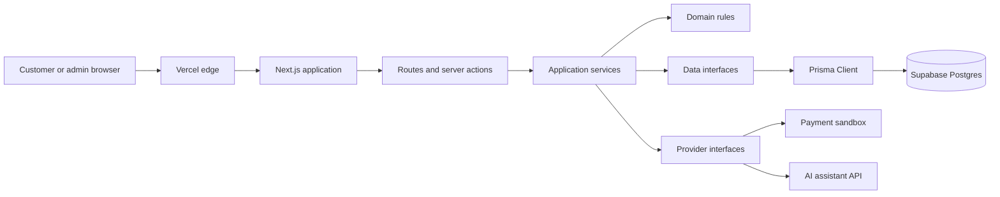

# Backend architecture specification

Related issue: #145

## Purpose

The application needs room for the storefront, admin tools, scent profiling, orders, payments,
support, and the AI assistant while remaining understandable for a student team. It will begin as a
modular Next.js application rather than several independently deployed services. A service split
requires a demonstrated scaling or ownership need.

## System boundary

Browser code may call approved application endpoints but never connects directly to privileged
database operations or third-party services using server credentials. Secrets stay in server-only
environment variables.

## Planned folder responsibilities

| Path | Responsibility |
| --- | --- |
| `src/app/` | Pages, layouts, route handlers, server actions, and request boundaries. |
| `src/components/` | Reusable interface components without privileged data access. |
| `src/lib/application/` | Use cases such as registering a customer, updating a cart, or placing an order. |
| `src/lib/domain/` | Business rules and domain types grouped by module. |
| `src/lib/data/` | Prisma-backed repositories and transaction boundaries. |
| `src/lib/integrations/` | Adapters for approved payment and AI services. |
| `src/lib/config/` | Validated, server-safe environment configuration. |
| `prisma/schema.prisma` | Reviewed data model and database provider configuration. |
| `prisma/migrations/` | Generated, reviewed, forward schema changes. |
| `tests/` | Unit, integration, and end-to-end checks using synthetic data. |

These directories will be added only when the application scaffold or relevant feature exists.
Empty folders are not committed to make the repository look complete.

## Modules

The issue list points to these application modules:

- `Auth`: registration, login, password handling, sessions, and role checks.
- `Customer`: customer profile, fragrance identity, preferences, and order history.
- `Catalog`: products, categories, collections, notes, search, and stock.
- `Recommendation`: quiz scoring, scent filters, and recommendation rules.
- `Cart` and `Order`: cart totals, promotions, checkout, shipping choice, orders, and invoices.
- `Payment`: payment attempts, sandbox callbacks, and payment status changes.
- `Support`: support inquiries, AI chat, and sanitized chat history.
- `Admin`: catalogue, inventory, customer-support, and analytics operations allowed by RBAC.

Modules communicate through application services or explicit interfaces. Route handlers and server
actions do not query another module's data directly.

## Request flow

1. Next.js accepts a request at a page, route handler, or server action.
2. The request boundary validates the payload and rejects malformed or unexpected input.
3. Authentication identifies the actor. Authorization checks the requested action and resource.
4. An application service applies business rules and calls data or provider interfaces.
5. Prisma repositories or provider adapters handle infrastructure details.
6. The application returns React output or JSON with safe error handling.

Request handlers stay small. They translate transport data and status codes; they do not calculate
prices, write raw queries, or decide access rules.

## Database rules

- Application services use repository functions backed by Prisma Client.
- Raw database queries require explicit review, parameter binding, and a documented reason.
- Related writes use a Prisma transaction. Checkout, stock changes, payment updates, and invoice
  creation must not leave half-written records.
- Schema changes use Prisma migrations. A migration already applied outside local development is
  not edited in place.
- Foreign keys and unique constraints protect relationships the application depends on.
- The runtime uses the pooled `DATABASE_URL`; migrations use the controlled `DIRECT_URL`.
- Tests and seed logic use synthetic data only.

The ERD and data dictionary define the exact model. This document does not guess the schema before
that work is reviewed.

## External services

Payment and AI code depend on project-owned interfaces. Provider SDKs and HTTP calls remain in
server-only adapters. Tests replace those adapters with fakes, allowing a sandbox provider to change
without rewriting checkout or support rules.

No payment provider, AI model, webhook URL, or production credential is selected here. Credentials
come from the environment and must never appear in commits, fixtures, screenshots, or logs.

## Error handling and logs

Expected problems return a useful application error and an appropriate HTTP status. Unexpected
exceptions receive an internal request reference and return a generic response in production.

Logs may include technical context such as a module name or internal record ID. They must not contain
passwords, API keys, session tokens, payment details, connection strings, or full customer scent
profiles.

## Decisions still open

The team still needs to approve the authentication design, payment sandbox, AI model configuration,
session strategy, backup verification, and detailed Vercel and Supabase environment ownership.
