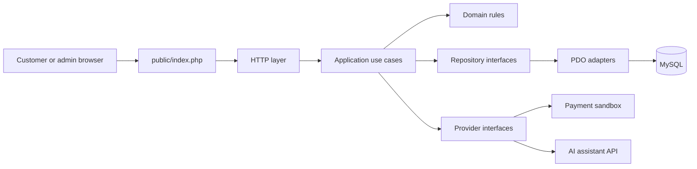

# Backend architecture specification

Related issue: #145

## Purpose

The backend needs room for the storefront, admin tools, scent profiling, orders, payments, support,
and the AI assistant. It also needs to stay understandable for a student team. The code will start as
a modular PHP application rather than several services. Splitting it into services now would add
deployment and debugging work without solving a current problem.

## System boundary

The browser only reaches `public/`. PHP code, configuration, migrations, logs, and credentials stay
outside the web root.

## Folder responsibilities

| Path | Responsibility |
| --- | --- |
| `public/` | Front controller and future public assets. No business logic or SQL. |
| `src/Http/` | Request parsing, routing, controllers, response formatting, and output escaping. |
| `src/Application/` | Use cases such as registering a customer, updating a cart, or placing an order. |
| `src/Domain/` | Business rules and domain types grouped by module. |
| `src/Infrastructure/` | MySQL repositories and adapters for approved external services. |
| `src/Config/` | Environment-backed configuration. |
| `src/Database/` | Shared PDO connection setup. |
| `database/migrations/` | Reviewed, forward-only schema changes. |
| `database/seeders/` | Synthetic development and test data. |
| `tests/Unit/` | Domain and application tests without network or database access. |
| `tests/Integration/` | MySQL and provider-adapter tests using test or sandbox services. |
| `storage/` | Runtime cache, logs, and sessions. Git ignores generated contents. |

`src/Application/`, `src/Domain/`, and `src/Infrastructure/` will be added as feature work begins.
Empty folders are not committed just to make the tree look complete.

## Modules

The issue list points to these backend modules:

- `Auth`: registration, login, password handling, sessions, and role checks.
- `Customer`: customer profile, fragrance identity, preferences, and order history.
- `Catalog`: products, categories, collections, notes, search, and stock.
- `Recommendation`: quiz scoring, scent filters, and recommendation rules.
- `Cart` and `Order`: cart totals, promotions, checkout, shipping choice, orders, and invoices.
- `Payment`: payment attempts, sandbox callbacks, and payment status changes.
- `Support`: support inquiries, AI chat, and sanitized chat history.
- `Admin`: catalog, inventory, customer-support, and analytics operations allowed by RBAC.

Modules may call another module through an application service or interface. They should not reach
into another module's tables from controllers.

## Request flow

1. The front controller creates the application and passes the HTTP request to the router.
2. The HTTP layer validates the request shape and rejects malformed input.
3. Authentication identifies the actor. Authorization checks the requested action and resource.
4. A use case applies the business rules and calls repository or provider interfaces.
5. Infrastructure adapters handle MySQL or sandbox API details.
6. The HTTP layer converts the result into HTML or JSON and escapes output for that format.

Controllers should stay small. They translate HTTP data and status codes; they do not calculate
prices, write SQL, or choose access rules.

## Database rules

- Repositories own SQL. Controllers and templates never run queries.
- PDO prepared statements remain native; emulated prepares stay disabled.
- Related writes use a transaction. Checkout, stock changes, payment updates, and invoice creation
  must not leave half-written records.
- Schema changes use new migration files. A merged migration is never edited in place.
- Foreign keys and unique constraints protect relationships that the application depends on.
- Tests and seeders use synthetic data only.

The ERD and data dictionary will define the exact tables. This document does not guess the schema
before that work is reviewed.

## External services

Payment and AI code will depend on project-owned interfaces. Provider SDKs and HTTP calls belong in
infrastructure adapters. Tests can replace those adapters with fakes, and the team can change a
sandbox provider without rewriting checkout or support rules.

No provider, AI model, webhook URL, or deployment secret is selected here. Credentials come from the
environment and must never appear in commits, fixtures, screenshots, or logs.

## Error handling and logs

Expected problems return a useful application error and an appropriate HTTP status. Unexpected
exceptions are logged with a request reference, then returned to users as a generic error when
`APP_DEBUG=false`.

Logs may include technical context such as a module name or internal record ID. They must not contain
passwords, API keys, session IDs, payment details, or full customer scent profiles.

## Decisions still open

The team still needs to choose the production hosting model, web server, payment sandbox, AI service
configuration, session storage, and backup process. Those choices belong in separate issues because
they depend on provider and assessment constraints that are not yet confirmed.
