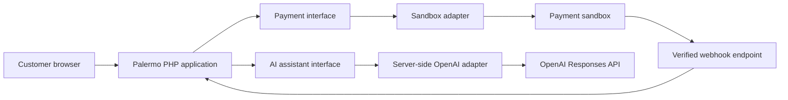

# Payment and AI integration boundaries

Related issue: #151

Payment and AI services stay behind application-owned interfaces. Controllers call use cases; use
cases call these interfaces; only infrastructure adapters know a provider's HTTP or SDK details.

The browser never receives provider secrets and never calls either provider with Palermo
credentials.

## Payment sandbox

The payment interface should support starting a payment, retrieving its status, and processing a
verified provider event. Exact method names and payloads belong to the implementation issue.

- Calculate the authoritative order ID, amount, currency, and payable items on the server.
- Use sandbox credentials and endpoints until the provider and live-payment process are approved.
- Give each payment attempt an idempotency key so a retry cannot create a second charge.
- Treat the browser redirect as user feedback, not proof of payment. Update payment and order status
  only after a signed webhook or a server-to-server status check is verified.
- Verify webhook signatures using the chosen provider's documented method. Reject stale or invalid
  events and record provider event IDs so repeated deliveries are harmless.
- Apply related payment, order, stock, and invoice changes in a database transaction.
- Store provider references, amount, currency, status, timestamps, and failure category. Do not
  store card numbers, security codes, or raw provider payloads.
- Retry only transient failures, with a short limit and backoff. Payment creation or finalisation is
  retried only when the idempotency guarantee is active.

The provider, currency rules, webhook path, signature algorithm, refund flow, and live credentials
remain undecided.

## AI assistant

The first adapter will use the OpenAI Responses API from PHP over server-side HTTPS. The model and
prompt are configuration choices to approve during implementation; they are not fixed in this
specification.

- Load `OPENAI_API_KEY` from the server environment. Never put it in browser code, source control,
  screenshots, logs, or client-visible errors.
- Send only the customer's current support question and the minimum approved context needed to
  answer it. Remove credentials, session identifiers, payment data, and unrelated profile fields.
- Keep the assistant informational. It cannot take payment, change an order, update stock, grant a
  role, or perform another privileged action.
- Validate input length and type before sending it. Treat model output as untrusted text and escape
  it for the page like any other user-controlled content.
- Do not use provider-side response storage unless a reviewed requirement needs it. Any local chat
  history follows the project's retention and access rules.
- Set a request timeout and a small retry limit for transient errors or rate limits. Show a normal
  support fallback when the service is unavailable; checkout and account features must still work.
- Log an internal request reference, provider request ID when available, timing, outcome, and token
  usage. Do not log prompts, responses, keys, or sensitive customer data by default.

Before implementation, the team must approve the assistant's allowed topics, refusal wording,
moderation approach, prompt version, model configuration, cost limit, and retention period.

## Adapter tests

Unit tests use fake adapters and cover success, timeout, provider rejection, duplicate webhook, and
malformed response cases. Integration tests use sandbox or test credentials supplied by CI secrets;
they never call a live payment environment or include real customer data.

## References

- [OpenAI developer quickstart](https://platform.openai.com/docs/quickstart)
- [OpenAI API authentication](https://platform.openai.com/docs/api-reference/authentication)
- [OpenAI platform data controls](https://platform.openai.com/docs/models/default-usage-policies-by-endpoint)
