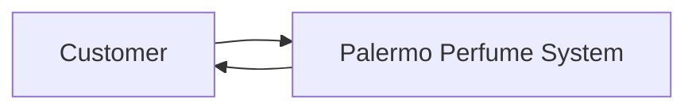

# Diagrams

Use Mermaid as the default source format for architecture diagrams, DFDs, ERDs, domain/class
diagrams, and process flows. Keep each diagram in a focused Markdown file so GitHub renders it and
reviewers can see meaningful line-by-line changes.

## Conventions

- Give every diagram a title, purpose, scope, and related issue number.
- Keep labels short and use the same entity/process names as the requirements and data dictionary.
- Use quoted Mermaid labels when text contains spaces or punctuation.
- Keep level-0 and level-1 DFDs in separate files.
- Export SVG or PDF only when an assessment submission needs a fixed artifact; Mermaid remains the
  editable source of truth.
- Store UI wireframes in their original design format because Mermaid is not a replacement for
  screen-level visual design.
