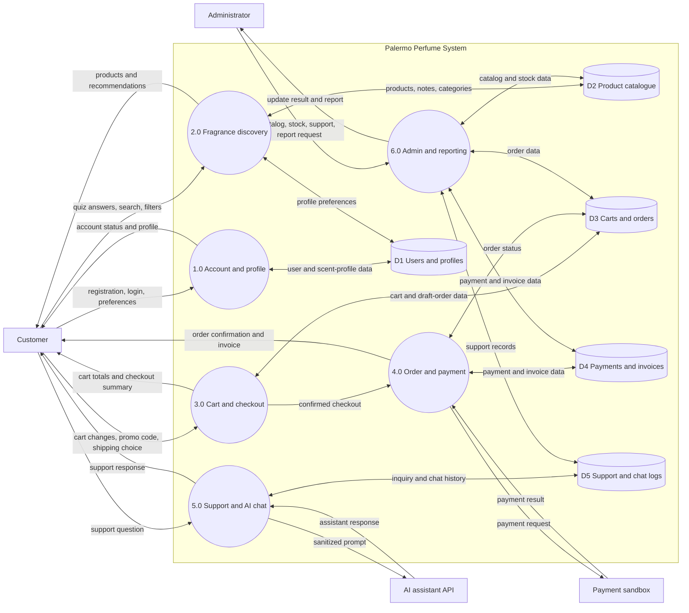

# Data flow diagram: level 1

Related issue: #146

This diagram breaks the Palermo Perfume System into its main processes. Data-store names are logical
and may change after the ERD and data dictionary are approved.

External services receive only the data needed for their request. Payment credentials, API keys,
session identifiers, and unnecessary profile details do not cross the system boundary.
