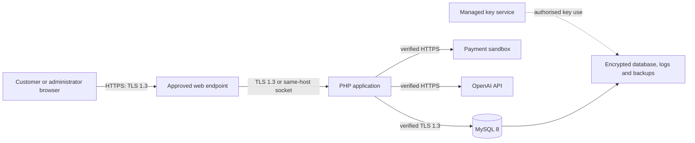

# Data encryption architecture

Related issue: #148

## Status

This document defines the required production design: AES-256 for protected data at rest and TLS
1.3 for data in transit. It does not claim that encryption is active. Hosting, certificate
termination, backup storage, and key-management services must be selected before the controls can be
configured and verified.

Encryption supports confidentiality and integrity, but it does not replace data minimisation,
authorization, secure queries, output encoding, or retention controls.

## Trust boundaries

A load balancer or reverse proxy may fill the web-endpoint role. If it terminates TLS on a different
host, traffic from that endpoint to PHP must also be encrypted and authenticated. A same-host Unix
socket is acceptable when its permissions are restricted and the hosting design records that
boundary.

## Data at rest

The approved hosting design must provide AES-256 encryption for every persistent copy containing
personal, authentication, order, support, or payment-reference data:

- MySQL tablespaces and database storage;
- database binary logs, temporary storage, replicas, and snapshots;
- backups and exported recovery files;
- application logs and persistent session storage; and
- file or object storage added later.

Storage encryption protects copied disks, snapshots, and backups. It does not protect data after the
application or database has legitimately decrypted it.

### Application-level encryption

Do not add field encryption by default. First use data minimisation, access control, and encrypted
storage. If the threat model later requires protection from database-only access, encrypt the
approved fields with a maintained cryptographic library using AES-256-GCM and a unique nonce for
each value. Store the algorithm version, key identifier, nonce, ciphertext, and authentication tag;
never reuse a key and nonce pair.

Passwords are not encrypted. Store only the output of PHP's `password_hash` function and verify it
with `password_verify`. Payment card numbers and security codes are not stored at all.

## Key management

- Generate production keys with an approved cryptographically secure key service.
- Keep keys outside source control, the MySQL database, application logs, and the backups they
  protect. Production master keys do not live in `.env` files.
- Grant the runtime identity permission to use only the keys it needs. Developers do not receive
  production key material.
- Separate data-encryption keys from key-encryption keys when the selected service supports envelope
  encryption.
- Record key identifiers and versions, never plaintext keys, so old records can be read during a
  controlled rotation.
- Rotate keys after suspected exposure, access changes, or the approved rotation interval. Test
  rotation and recovery before production.
- Back up key material through the selected key service's protected recovery process. Losing the
  only decryption key must not silently make every backup unusable.
- Use disposable, non-production keys for local development and CI.

No custom cipher, key derivation scheme, or encryption format may be designed by the project team.

## Data in transit

- Default the public website to TLS 1.3 on every route. Disable SSL, TLS 1.0, and TLS 1.1. TLS 1.2
  may be enabled only if a documented client-compatibility requirement is approved.
- Redirect browser HTTP requests to HTTPS, then enable HSTS after HTTPS is confirmed across the
  production domain. Mark production session cookies `Secure` and `HttpOnly`.
- Use a publicly trusted, hostname-matching certificate. Automate renewal and alert before expiry.
- Require certificate and hostname verification for payment and AI HTTPS requests. Never disable
  verification to make a failing integration pass.
- Require an encrypted MySQL connection with certificate verification when PHP and MySQL communicate
  over a network. Confirm the negotiated protocol and cipher from the live database session.
- Accept payment webhooks only over HTTPS and still verify their provider signature; TLS does not
  prove that a request is an authentic provider event.

Local loopback development and isolated CI services may use plain HTTP or a local database socket.
That exception does not apply to staging, production, shared networks, or external services.

## Configuration ownership

| Control | Expected owner | Evidence required before release |
| --- | --- | --- |
| Public TLS and certificate | Hosting or reverse-proxy configuration | Protocol scan, valid chain, renewal test, and HSTS response |
| PHP-to-MySQL TLS | Database and application configuration | Certificate validation enabled and live session reports TLS 1.3 |
| Database and disk encryption | Database or hosting service | Provider setting or configuration showing AES-256 is active |
| Backup encryption | Hosting and backup service | Encrypted backup plus successful authorised restore test |
| Key storage and rotation | Managed key service | Access policy, rotation record, and recovery test |
| External API transport | PHP provider adapters | Integration tests reject an invalid certificate and use HTTPS only |

## Release gate

Production release is blocked until the team records:

1. where TLS terminates and how every remaining network hop is protected;
2. which service owns certificates, encryption keys, rotation, and recovery;
3. which database files, logs, snapshots, and backups are covered by AES-256;
4. evidence from the checks in the configuration table; and
5. the accepted reason for any TLS 1.2 compatibility exception.

## References

- [NIST FIPS 197: Advanced Encryption Standard](https://csrc.nist.gov/pubs/fips/197/final)
- [OWASP Cryptographic Storage Cheat Sheet](https://cheatsheetseries.owasp.org/cheatsheets/Cryptographic_Storage_Cheat_Sheet.html)
- [OWASP Transport Layer Security Cheat Sheet](https://cheatsheetseries.owasp.org/cheatsheets/Transport_Layer_Security_Cheat_Sheet.html)
- [MySQL 8.0 encrypted connection protocols](https://dev.mysql.com/doc/refman/8.0/en/encrypted-connection-protocols-ciphers.html)
- [MySQL 8.0 InnoDB data-at-rest encryption](https://dev.mysql.com/doc/refman/8.0/en/innodb-data-encryption.html)
