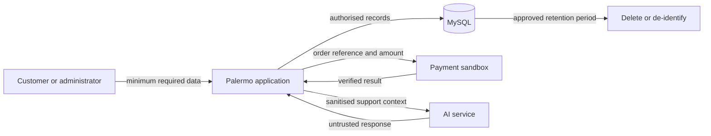

# Privacy impact assessment

Related issue: #147

## Assessment outcome

A privacy impact assessment is required because the planned system collects, stores, uses, and
discloses personal information. The main risks are customer-account misuse, excessive collection,
AI-service disclosure, payment metadata, and retention without an approved deletion schedule.

This is a design-stage assessment, not legal advice or production approval. The Australian Privacy
Principles are used as the design benchmark. The organisation must confirm which legal obligations
apply before release.

## Scope and people affected

The assessment covers the planned website, MySQL database, administrator access, payment sandbox,
AI-assisted support, application logs, and backups. It covers customers, visitors who submit data,
and administrators whose actions are logged.

It does not approve a hosting location, payment provider, production AI configuration, analytics
tool, marketing platform, or backup service. Those choices are still open.

## Personal information

| Data group | Purpose | Required handling rule |
| --- | --- | --- |
| Account and contact details | Create an account, authenticate, communicate, and deliver orders | Collect only fields needed for the selected service. |
| Scent profile and quiz answers | Personalise fragrance recommendations | Make non-essential answers optional and do not solicit health information. |
| Cart, order, delivery, and invoice details | Complete and support purchases | Restrict customers to their own records and administrators to approved duties. |
| Payment metadata | Match an order to a provider result | Store references and status only; never store card numbers or security codes. |
| Support questions and AI responses | Answer inquiries and maintain support continuity | Remove unnecessary identifiers before external processing. |
| Security and administration logs | Investigate faults, misuse, and privileged changes | Record the event and reference, not secrets or full customer content. |

Real customer data must not appear in development fixtures, automated tests, screenshots, or issue
reports.

## Information flow

The detailed functional data flow is documented in the
[Level 1 data flow diagram](../diagrams/dfd-level-1.md). External services remain separate data
handlers even when Palermo does not store their full response.

## Risk assessment

Ratings use `Low`, `Medium`, or `High`. Remaining risk assumes every listed control is implemented
and tested.

| Privacy risk | Initial risk | Required treatment | Remaining risk |
| --- | :---: | --- | :---: |
| Unnecessary profile or quiz data is collected | High | Define each field's purpose, make optional fields clear, reject unknown fields, and review forms for data minimisation. | Low |
| Another customer accesses an account, order, invoice, or inquiry | High | Apply server-side RBAC, record ownership checks, secure sessions, and authorization tests. | Medium |
| An administrator misuses broad access | High | Use least privilege, require fresh authentication for role changes, and audit sensitive admin actions. | Medium |
| Injection, XSS, or CSRF exposes or changes personal information | High | Apply the documented validation, encoding, prepared-statement, and CSRF controls. | Low |
| Payment details or credentials leak | High | Keep provider calls server-side, store no card data, use environment secrets, and redact logs and errors. | Low |
| More customer context than necessary is sent to the AI service | High | Allow only support use, sanitise context, exclude payment and session data, and keep provider-side storage off unless reviewed. | Medium |
| A provider processes data in an undisclosed overseas location or under unsuitable terms | High | Review provider location, subprocessors, retention, deletion, security, and contract terms before selection; update notices. | Pending |
| Chat history, logs, orders, or backups are retained indefinitely | High | Approve a record-level retention schedule and tested deletion or de-identification process before release. | Pending |
| Personal information is lost through weak hosting, backups, or transport security | High | Approve access controls, TLS, encryption, backup protection, restoration testing, and secret rotation with the hosting design. | Pending |
| A person cannot understand, access, or correct their information | Medium | Publish clear collection notices and a privacy policy, then provide an authenticated request and correction process. | Low |

`Pending` means the design cannot yet show an acceptable remaining risk because a provider,
retention, or hosting decision has not been made.

## Required actions before release

- Approve a privacy policy and just-in-time collection notices that state purpose, disclosures, and
  contact or complaint routes.
- Approve a retention schedule for accounts, scent profiles, carts, orders, invoices, support chats,
  provider references, logs, and backups.
- Document how a customer can access and correct their information, and how deletion requests are
  assessed against genuine retention obligations.
- Review payment, AI, hosting, email, analytics, and backup providers before personal information is
  sent to them. Record their locations, terms, subprocessors, security, and deletion options.
- Define a data-breach response process and the person responsible for privacy inquiries.
- Confirm that forms do not collect sensitive information. If health, allergy, or other sensitive
  information becomes a requirement, repeat this assessment before implementation.
- Test authorization, export/correction, deletion, log redaction, provider failure, and backup
  restoration controls before production approval.

## Review triggers

Review this assessment when a provider or hosting service is chosen, a new category of personal
information is proposed, data is used for a new purpose, an administrator role changes, an incident
occurs, or before production release. Record decisions and unresolved risks in the relevant issue or
pull request.

## References

- [OAIC guide to undertaking privacy impact assessments](https://www.oaic.gov.au/privacy/privacy-guidance-for-organisations-and-government-agencies/privacy-impact-assessments/guide-to-undertaking-privacy-impact-assessments)
- [OAIC Australian Privacy Principles](https://www.oaic.gov.au/privacy/australian-privacy-principles/read-the-australian-privacy-principles)
- [OAIC APP 3 guidance on collecting personal information](https://www.oaic.gov.au/privacy/australian-privacy-principles/australian-privacy-principles-guidelines/chapter-3-app-3-collection-of-solicited-personal-information)
- [OAIC APP 11 guidance on securing personal information](https://www.oaic.gov.au/privacy/australian-privacy-principles/australian-privacy-principles-guidelines/chapter-11-app-11-security-of-personal-information)
