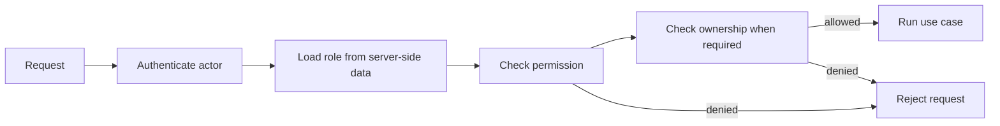

# Role-based access control

Related issue: #150

The current scope needs two stored roles: `customer` and `administrator`. A visitor is an
unauthenticated actor, not a database role. More staff roles should be added only when the
requirements define separate responsibilities.

## Permission matrix

| Action | Visitor | Customer | Administrator |
| --- | :---: | :---: | :---: |
| View and search the catalogue | Yes | Yes | Yes |
| Complete the fragrance quiz | Yes | Yes | Yes |
| Save a scent profile | No | Own profile | No |
| Manage a cart and place an order | No | Own cart/order | No |
| View order history and invoices | No | Own records | All records |
| Open and view a support inquiry | No | Own inquiries | All inquiries |
| Respond to support inquiries | No | No | Yes |
| Manage products, categories, and stock | No | No | Yes |
| Update order fulfilment status | No | No | Yes |
| View admin analytics | No | No | Yes |
| Assign or remove administrator access | No | No | Yes |

Payment status is set by verified payment processing, not by a customer or a browser-supplied role.

## Authorization flow

## Enforcement rules

- Deny access unless a policy explicitly allows it.
- Load roles from trusted server-side data. Ignore role names or user IDs supplied by the browser.
- Check authorization inside the application use case, not only in menus or page routes.
- Scope customer queries by the authenticated customer ID.
- Recheck ownership when reading, updating, or deleting a record.
- Return `401` when authentication is required and `403` when an authenticated actor lacks permission.
- Log administrator role changes and sensitive admin actions without logging private customer data.
- Require a fresh password check before changing administrator access.

Hiding an admin button is a user-interface choice, not an access control. The backend must reject the
same request when it is sent directly.
