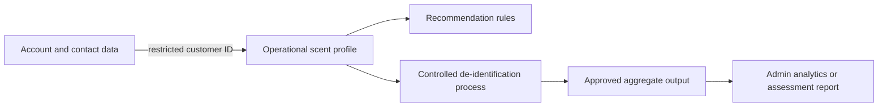

# Scent-profile anonymisation and privacy protocol

Related issue: #149

## Core rule

A customer's live scent profile is personal information because the system can link it back to the
customer. Replacing a name with an internal ID makes the record pseudonymous, not anonymous. It must
still receive the same access, security, retention, and breach protections as other customer data.

The project may describe an extract as de-identified only after direct identifiers, indirect
identifiers, rare combinations, free text, and its release environment have all been assessed and
the likelihood of re-identification is very low.

## Collection protocol

- Collect only quiz answers and preferences that directly support fragrance recommendations.
- Prefer bounded choices such as scent family, intensity, occasion, and disliked notes over free
  text.
- Do not request medical conditions, allergies, ethnicity, biometric data, or other sensitive
  information as part of the scent quiz.
- Explain which answers are optional, what recommendation purpose they serve, and whether they will
  be saved.
- Allow a customer to retake the quiz, correct saved preferences, or clear the profile without
  deleting their account.
- Do not infer sensitive traits, identity, or protected characteristics from scent preferences.

## Operational separation

Contact details belong in account records. Scent answers and the calculated fragrance identity
belong in profile records linked through an opaque internal customer ID. Application use cases may
join them only for an authorised customer action or approved administrator duty.

## Approved uses

| Use | Data permitted | Rule |
| --- | --- | --- |
| Personal recommendation | Current customer's saved answers and catalogue data | Keep processing inside Palermo. |
| Customer profile screen | Current customer's own profile | Enforce ownership on every read and change. |
| Support | Minimum profile detail needed for the inquiry | Do not expose the complete profile by default. |
| AI-assisted support | Sanitised question and only necessary scent traits | Exclude name, contact, order, payment, session, and internal IDs. |
| Admin analytics | Aggregated, de-identified groups | No customer-level browsing for general analytics. |
| Development and tests | Synthetic profiles | Never copy production profiles into fixtures. |

Scent profiles must not be sold, used for unrelated advertising, or used to train an AI model. A new
purpose requires an updated privacy assessment and an appropriate customer notice or consent review.

## De-identification procedure

1. Record the specific purpose, audience, and access environment for the output.
2. Start from the smallest set of fields needed for that purpose.
3. Remove names, email addresses, phone numbers, delivery addresses, account IDs, order references,
   support text, and precise timestamps.
4. Replace any necessary row identifier with a random, export-specific token. Keep no token lookup
   table unless the approved purpose requires a reversible pseudonymous dataset.
5. Generalise values that could isolate a person, such as replacing exact dates with a broad period
   and combining rare preference categories.
6. Suppress groups with fewer than 10 customers. This is a minimum disclosure control, not proof
   that the remaining data is anonymous.
7. Test whether records could be singled out or linked with reasonably available information.
8. Release the result only to the approved audience with export, onward-sharing, and deletion
   controls appropriate to the remaining risk.
9. Record who approved the extract, its fields, purpose, recipients, risk result, and deletion date.

Public or open-data release is outside the current scope. It requires specialist review because a
controlled internal extract and a public dataset have different re-identification risks.

## Logging and deletion

- Logs may contain a profile record reference and action outcome, but not quiz answers or generated
  fragrance descriptions.
- Deleted quiz answers must also leave caches, search indexes, analytics staging data, and future
  backups according to the approved retention schedule.
- Aggregated statistics may remain only when they cannot reasonably be used to reconstruct or single
  out a customer.
- Database access, exports, and admin views follow the RBAC specification and are auditable.

Exact retention periods are pending. No production launch is approved until the privacy impact
assessment's retention and provider actions are resolved.

## Verification

Tests must confirm that one customer cannot access another profile, clearing a profile removes its
saved answers, AI payloads omit blocked fields, logs contain no profile content, and analytics
suppresses small groups. A reviewer must inspect every new export or analytics query for direct and
indirect identifiers.

## References

- [OAIC guidance on de-identification and the Privacy Act](https://www.oaic.gov.au/privacy/privacy-guidance-for-organisations-and-government-agencies/handling-personal-information/de-identification-and-the-privacy-act)
- [OAIC APP 3 guidance on collecting personal information](https://www.oaic.gov.au/privacy/australian-privacy-principles/australian-privacy-principles-guidelines/chapter-3-app-3-collection-of-solicited-personal-information)

