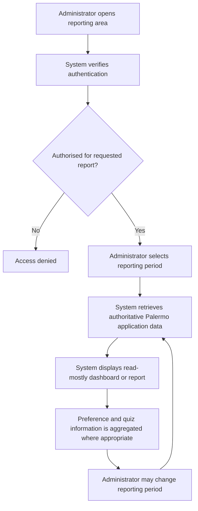
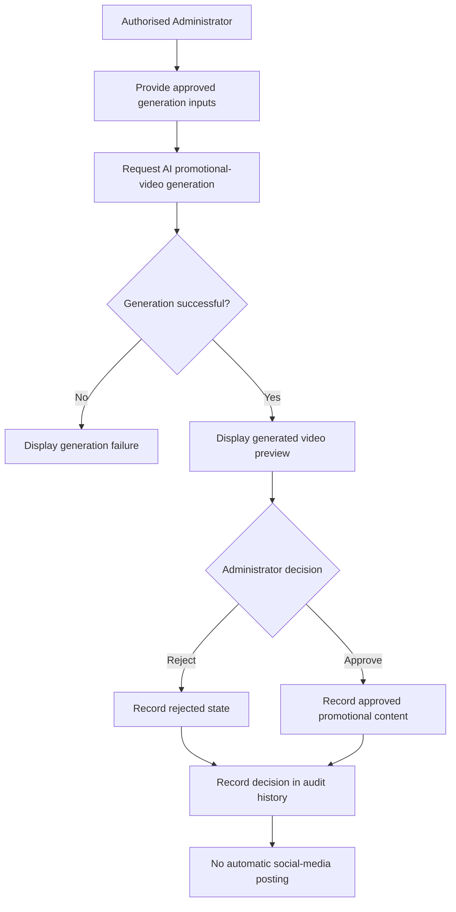

# Admin and Derived Modules Use-Case Specifications

## Purpose

This document defines the approved SRS use cases for the Palermo administrative, reporting, inventory, production-batch, review/community, loyalty, subscription, referral, promotion and promotional-content functions included in Issue #166.

Derived requirements remain identified as `DER-*` requirements and are not presented as source-numbered Palermo functional requirements.
## Canonical References

This specification is derived from and must remain consistent with the following canonical SRS sources:

* `docs/requirements/functional-requirements.md`
* `docs/requirements/derived-requirements.md`
* `docs/requirements/decision-register.md`
* `docs/requirements/actor-registry.md`

Where a conflict exists, the approved canonical requirement and decision sources take precedence.

## Scope Boundaries

This work package defines SRS use-case requirements only. It does not define:

* application code;
* database schemas;
* APIs;
* backend security implementation;
* ERP or raw-material manufacturing functionality;
* recurring billing or automatic recurring perfume orders;
* social-network functionality;
* automated or scheduled social-media posting; or
* unsupported analytics or reporting capabilities.

Derived requirements identified with the `DER-*` prefix are approved development-team-derived SRS requirements and must remain distinguishable from original source-numbered Palermo functional requirements.

## Actors

- Administrator
- Customer
- AI service/API, where applicable as an external supporting system

## Requirement Scope

### Source Functional Requirements

`FR-ADMIN-001` through `FR-ADMIN-013`

### Approved Derived Requirements

- `DER-INVENTORY-001` through `DER-INVENTORY-006`
- `DER-REVIEW-001`
- `DER-COMMUNITY-001`
- `DER-LOYALTY-001`
- `DER-SUBSCRIPTION-001`
- `DER-REFERRAL-001`
- `DER-PROMO-001`
- `DER-SOCIAL-001`
- `DER-SOCIAL-002`

## Use Cases

### UC-ADM-001 — View Administrative Dashboard and Reports

**Primary actor:** Administrator

**Related requirements:** `FR-ADMIN-001` through `FR-ADMIN-009`

**Related decisions:** `D-057`, `D-058`, `D-060`, `D-061`, `D-062`, `D-066`

**Goal:**
Allow an authorised administrator to view Palermo business and operational reporting information through the administrative dashboard.

**Preconditions:**

- The administrator is authenticated.
- The administrator has the required server-authorised permission to access administrative reporting.
- Authoritative Palermo application data is available for the requested reporting period.

**Trigger:**
The administrator opens the dashboard or selects an available administrative report.

**Main flow:**

1. The administrator accesses the administrative reporting area.
2. The system verifies that the administrator is authorised to access the requested reporting information.
3. The administrator selects a reporting period where applicable.
4. The system retrieves reporting values from authoritative Palermo application data.
5. The system displays the applicable dashboard or report information, including:
   - total sales;
   - total orders;
   - best-selling perfumes;
   - most popular fragrance notes;
   - customer preference information;
   - fragrance quiz result information;
   - inventory reporting;
   - promotion performance; and
   - AI recommendation performance.
6. Customer preference and fragrance quiz information is presented in aggregated form where individual customer identity is not required.
7. The administrator may change the selected reporting period or move between available reports.
8. The system refreshes the displayed information according to the selected reporting context.

**Alternative and exception flows:**

- If the administrator does not have permission to access the requested report, access is denied.
- If reporting data is unavailable for the selected period, the system indicates that no applicable reporting data is available.
- AI-generated values are not treated as authoritative business metrics.

**Postconditions:**

- The administrator has viewed the requested authorised reporting information.
- No business data is changed as a result of viewing the dashboard or reports.

**Business and scope rules:**

- Reporting interfaces are read-mostly.
- Refund or adjustment treatment must not be introduced into reporting metrics unless the corresponding workflows and metric definitions are explicitly approved.
- Business-changing actions must use separate authorised administrative workflows rather than report visualisations.
- Reporting metrics use explicit reporting periods and documented definitions.
- Access remains subject to server-enforced, deny-by-default, least-privilege RBAC.
#### Administrative Reporting Flow

### UC-ADM-002 — Manage Administrative Accounts and Access

**Primary actor:** Administrator

**Related requirements:** `FR-ADMIN-010`, `FR-ADMIN-011`

**Related decisions:** `D-057`, `D-058`, `D-059`, `D-063`

**Goal:**
Allow an appropriately authorised administrator to manage administrative accounts and their approved role-based access while enforcing least-privilege access control.

**Preconditions:**

- The administrator is authenticated.
- The administrator has the required server-authorised permission to manage administrative accounts or access assignments.
- The applicable administrative account exists when an existing account is being modified.

**Trigger:**
The administrator opens the administrative account and access-management area and selects an account-management or access-control action.

**Main flow:**

1. The administrator accesses the administrative account and access-management area.
2. The system verifies that the administrator is authorised to perform the requested management action.
3. The system displays the administrative accounts and access information that the administrator is permitted to manage.
4. The administrator selects an approved action, such as:
   - creating an administrative account;
   - deactivating an administrative account; or
   - assigning or updating approved role-based access.
5. The administrator provides or selects the required account or access information.
6. The system validates the requested change against the approved server-enforced RBAC rules.
7. The system applies the authorised account or access change.
8. The system records the privileged action in the audit history with the relevant actor, action, target, time and outcome information.
9. The system confirms the result to the administrator.

**Alternative and exception flows:**

- If the administrator lacks permission for the requested action, the system denies the request.
- If the requested access assignment would violate approved RBAC rules or least-privilege constraints, the system rejects the change.
- If required account information is invalid or incomplete, the system does not apply the change and indicates that correction is required.
- An administrator cannot silently escalate their own access or bypass the approved authorisation rules.

**Postconditions:**

- An authorised administrative account or access change has been completed, or the requested change has been rejected without modifying access.
- Successful privileged changes are represented in the audit history.

**Business and scope rules:**

- Administrative access is server-authorised and deny-by-default.
- Least-privilege RBAC applies to administrative capability.
- Organisational staff job titles or unsupported administrative roles must not be invented.
- Administrative account creation, deactivation and access assignment require appropriate permission.
- This use case defines required behaviour only and does not specify backend security implementation.

### UC-ADM-003 — View and Search Audit History

**Primary actor:** Administrator

**Related requirements:** `FR-ADMIN-012`

**Related decisions:** `D-057`, `D-058`, `D-063`, `D-064`

**Goal:**
Allow an authorised administrator to view, search and filter approved administrative audit-history information without modifying historical audit records.

**Preconditions:**

- The administrator is authenticated.
- The administrator has the required server-authorised permission to access audit-history information.
- Audit records exist where applicable.

**Trigger:**
The administrator opens the audit-log management area.

**Main flow:**

1. The administrator accesses the audit-history area.
2. The system verifies that the administrator is authorised to view audit information.
3. The system displays audit records that the administrator is permitted to access.
4. The displayed audit information may include relevant:
   - actor;
   - action;
   - target;
   - time;
   - outcome; and
   - approved correlation or change metadata.
5. The administrator may search or filter the audit history using available criteria.
6. The system applies the selected search or filter criteria.
7. The system displays the matching audit records.
8. The administrator may inspect an authorised audit record in greater detail where permitted.

**Alternative and exception flows:**

- If the administrator does not have permission to access audit history, the system denies access.
- If no audit records match the selected criteria, the system indicates that no matching records are available.
- If invalid search or filter criteria are provided, the system does not apply them and indicates that correction is required.

**Postconditions:**

- The administrator has viewed authorised audit-history information.
- Historical audit-event content has not been changed.

**Business and scope rules:**

- Security-relevant and privileged administrative actions are audit logged.
- Audit information records appropriate actor, action, target, time and outcome information without exposing secrets.
- Audit history supports authorised viewing, searching and filtering.
- Ordinary administrators cannot alter historical audit-event content.
- Audit retention is policy-driven.

### UC-ADM-004 — Manage Data Backup Operations

**Primary actor:** Administrator

**Related requirements:** `FR-ADMIN-013`

**Related decisions:** `D-057`, `D-058`, `D-063`, `D-065`

**Goal:**
Allow an authorised administrator to invoke an approved data backup operation and view backup status and metadata.

**Preconditions:**

- The administrator is authenticated.
- The administrator has the required server-authorised permission to manage backup operations.
- The approved backup capability is available.

**Trigger:**
The administrator opens the backup-management area or chooses to create an approved backup.

**Main flow:**

1. The administrator accesses the backup-management area.
2. The system verifies that the administrator is authorised to perform backup operations.
3. The system displays available backup information and permitted backup actions.
4. The administrator chooses to invoke an approved backup operation.
5. The system requests confirmation where required.
6. The administrator confirms the backup request.
7. The system initiates the approved backup operation.
8. The system records the relevant backup status and metadata.
9. The system records the privileged backup action in the audit history.
10. The system displays the current or resulting backup status to the administrator.

**Alternative and exception flows:**

- If the administrator lacks permission to perform backup operations, the system denies the request.
- If the backup operation cannot be started or fails, the system records and displays the applicable failure status.
- If the administrator cancels before confirmation, no backup operation is initiated.

**Postconditions:**

- An approved backup operation has been initiated and its status or metadata recorded, or the request has ended without creating a backup.
- The privileged backup action is represented in the audit history.
**Business and scope rules:**

- Backup operations are restricted to appropriately authorised administrators.
- Backup invocation and status are auditable.
- Backup management includes approved backup creation, status/metadata visibility and support for a documented restore procedure.
- This use case does not define backup storage architecture, database schema or backend implementation.

## Inventory and Production Batch Use Cases
### UC-INV-001 — View Variant Inventory and Stock Movement Information

**Primary actor:** Administrator

**Requirement provenance:** Approved development-team-derived SRS requirements

**Related requirements:** `DER-INVENTORY-001`, `DER-INVENTORY-002`, `DER-INVENTORY-005`

**Related decisions:** `D-057`, `D-058`, `D-067`, `D-068`, `D-071`, `D-072`

**Goal:**
Allow an authorised administrator to view sellable perfume-variant inventory information, identify low-stock variants and inspect attributable stock-movement information.

**Preconditions:**

- The administrator is authenticated.
- The administrator has the required server-authorised permission to access inventory information.
- Sellable perfume variants exist where applicable.

**Trigger:**
The administrator opens the inventory-management area or selects a perfume variant to inspect.

**Main flow:**

1. The administrator accesses the inventory area.
2. The system verifies that the administrator is authorised to view inventory information.
3. The system displays inventory at the sellable perfume-variant level.
4. For each permitted variant, the system displays applicable stock information, including:
   - on-hand quantity;
   - reserved or committed quantity;
   - available quantity; and
   - low-stock status where applicable.
5. The administrator selects a perfume variant to inspect.
6. The system displays attributable inventory-movement information associated with the selected variant.
7. The movement information includes the applicable:
   - quantity change;
   - source or reason;
   - reference; and
   - timestamp.
8. The administrator may view variants that are at or below their configured low-stock threshold.
9. The administrator may return to the inventory overview or inspect another variant.

**Alternative and exception flows:**

- If the administrator lacks permission to access inventory information, the system denies access.
- If no movement history exists for the selected variant, the system indicates that no movement records are available.
- If a variant is not at or below its configured low-stock threshold, it is not identified as low stock.

**Postconditions:**

- The administrator has viewed authorised variant-level stock or inventory-movement information.
- Viewing inventory information does not itself change stock quantities.

**Business and scope rules:**

- Inventory is tracked at the sellable perfume-variant level.
- Available stock accounts for reserved or committed quantities.
- Every inventory quantity change must be attributable through an inventory movement.
- Inventory reservation and commitment controls must prevent allocation beyond available stock.
- Failed or expired reservations must be released safely.
- Automatic purchasing, replenishment or production ordering is outside the approved scope.
- This use case does not define database schema, persistence controls, APIs or backend implementation.

### UC-INV-002 — Record and Release Finished-Perfume Production Batch

**Primary actor:** Administrator

**Requirement provenance:** Approved development-team-derived SRS requirements

**Related requirements:** `DER-INVENTORY-003`, `DER-INVENTORY-004`

**Related decisions:** `D-057`, `D-058`, `D-063`, `D-069`, `D-070`

**Goal:**
Allow an authorised administrator to record a finished-perfume production batch for a sellable variant and release that batch into sellable inventory through the approved workflow.

**Preconditions:**

- The administrator is authenticated.
- The administrator has the required server-authorised permission to manage production batches.
- The applicable sellable perfume variant exists.

**Trigger:**
The administrator opens the production-batch area and chooses to record a new finished-perfume batch or release an existing recorded batch.

**Main flow:**

1. The administrator accesses the production-batch management area.
2. The system verifies that the administrator is authorised to manage production batches.
3. The administrator selects the applicable sellable perfume variant.
4. The administrator enters the required finished-perfume batch information.
5. The system validates the provided batch information.
6. The system records the production batch without changing sellable inventory.
7. When the batch is ready for release, the administrator selects the authorised release action.
8. The system verifies that the administrator is authorised to release the batch.
9. The system releases the batch into sellable inventory.
10. The corresponding inventory movement is recorded exactly once.
11. The system records the privileged production-batch recording or release action in the audit history.
12. The system confirms the release result and updated inventory status.

**Alternative and exception flows:**

- If the administrator lacks permission to record or release a batch, the system denies the requested action.
- If required batch information is invalid or incomplete, the system does not record the batch and indicates that correction is required.
- If a recorded batch has not been released, it does not increase sellable inventory.
- If the batch has already been released, the system must not apply the same inventory movement again.

**Postconditions:**

- A finished-perfume production batch has been recorded, or
- an authorised recorded batch has been released and the corresponding inventory movement has been applied exactly once.

**Business and scope rules:**

- Production-batch management is limited to finished-perfume batches associated with sellable variants.
- Recording a production batch does not itself alter sellable inventory.
- Sellable inventory changes only through the authorised batch-release workflow.
- Raw-material procurement, formulation, manufacturing scheduling and ERP functionality are outside the approved scope.
- This use case does not define database schema, APIs or backend implementation.

#### INV-SYS-001 — Inventory Reservation and Commitment Invariant

**Requirement provenance:** Approved development-team-derived SRS requirement

**Related requirement:** `DER-INVENTORY-006`

**Related decision:** `D-072`

This supporting system behaviour defines the required reservation and commitment behaviour used by applicable order-processing workflows.

- Reservation and commitment operations shall prevent reserved or committed quantities from exceeding inventory available for allocation.
- A reservation, commitment or release shall behave atomically from the SRS perspective: the requested state change is completed as one consistent business operation or is not partially applied.
- Failed or expired reservations shall be released safely.
- The same reservation or commitment shall not be released more than once for the same release event.
- Concurrent or overlapping requests shall not result in over-allocation of the same available inventory.
- This requirement has no direct Administrator UI responsibility.
- This specification defines required system behaviour only and does not prescribe database transactions, locking mechanisms, database schema, APIs or persistence implementation.

## Reviews and Fragrance Community Use Cases
### UC-REV-001 — Submit and View a Perfume Review

**Primary actor:** Customer

**Requirement provenance:** Approved development-team-derived SRS requirements

**Related requirements:** `DER-REVIEW-001`, `DER-COMMUNITY-001`

**Related decisions:** `D-073`, `D-074`

**Goal:**
Allow an authenticated customer to submit one rating and short text review for a perfume they have purchased and participate in the approved shared public review space.

**Preconditions:**

- The customer is authenticated.
- The customer has purchased the perfume being reviewed.
- The customer has not already submitted a review for that purchased perfume.

**Trigger:**
The customer opens an eligible purchased perfume and chooses to submit a review.

**Main flow:**

1. The customer accesses the review area for an eligible purchased perfume.
2. The system verifies that the customer is authenticated and eligible to review the perfume.
3. The system presents the review submission interface.
4. The customer provides:
   - one rating; and
   - a short text review.
5. The customer submits the review.
6. The system validates the review submission.
7. The system records the review for the applicable perfume.
8. The review becomes part of the shared public review space, subject to administrative moderation.
9. Customers and visitors may view reviews that remain publicly available.

**Alternative and exception flows:**

- If the customer has not purchased the perfume, the system does not permit review submission.
- If the customer has already submitted a review for that purchased perfume, the system does not permit a second review.
- If required review information is missing or invalid, the system does not accept the submission and indicates that correction is required.
- A review may later be hidden or removed through authorised administrative moderation.

**Postconditions:**

- A valid customer review has been recorded and may be publicly visible subject to moderation, or
- no review has been created if the submission was not eligible or valid.

**Business and scope rules:**

- A customer may submit one rating and short text review per purchased perfume.
- Public reviews constitute the baseline Palermo fragrance-community capability.
- The approved community scope does not include replies, likes, follows, direct messages or community feeds.
- Palermo does not provide a separate social-network platform.
- Review visibility remains subject to authorised administrative moderation.

### UC-REV-002 — Moderate Public Reviews

**Primary actor:** Administrator

**Requirement provenance:** Approved development-team-derived SRS requirements

**Related requirements:** `DER-REVIEW-001`

**Related decisions:** `D-057`, `D-058`, `D-063`, `D-073`

**Goal:**
Allow an authorised administrator to review and moderate publicly submitted perfume reviews in accordance with the approved review scope.

**Preconditions:**

- The administrator is authenticated.
- The administrator has the required server-authorised permission to moderate reviews.
- One or more customer reviews exist where applicable.

**Trigger:**
The administrator opens the review-moderation area or selects a review requiring moderation.

**Main flow:**

1. The administrator accesses the review-moderation area.
2. The system verifies that the administrator is authorised to moderate reviews.
3. The system displays reviews that the administrator is permitted to inspect.
4. The administrator selects a review.
5. The system displays the review information, including the applicable rating, short text review and related perfume.
6. The administrator assesses the review for moderation.
7. The administrator chooses an approved moderation action, such as:
   - leaving the review publicly visible;
   - hiding the review; or
   - removing the review.
8. The system applies the authorised moderation action.
9. The system records the privileged moderation action in the audit history.
10. The system confirms the moderation result.

**Alternative and exception flows:**

- If the administrator lacks permission to moderate reviews, the system denies the action.
- If the selected review is no longer available, the system indicates that the review cannot be moderated.
- If the requested moderation action is invalid or unauthorised, the system does not apply the change.

**Postconditions:**

- The selected review remains visible, is hidden or is removed according to the authorised moderation action.
- Review moderation actions are auditable.

**Business and scope rules:**

- Review moderation is limited to the approved public-review capability.
- Administrators may hide or remove inappropriate reviews.
- The system does not introduce replies, likes, follows, direct messages or community-feed moderation.
- The moderation workflow does not create a separate social-network capability.
- This use case defines required behaviour only and does not specify backend moderation implementation.

## Loyalty, Subscription and Referral Use Cases
### UC-LOY-001 — Earn, View and Redeem Loyalty Points

**Primary actor:** Customer

**Requirement provenance:** Approved development-team-derived SRS requirements

**Related requirements:** `DER-LOYALTY-001`

**Related decisions:** `D-075`

**Goal:**
Allow loyalty points to be awarded when a qualifying customer order reaches the approved completed state, and allow the authenticated customer to view and redeem available points according to configured loyalty rules.

**Preconditions:**

- The customer is authenticated.
- The customer has an active Palermo customer account.
- Loyalty-point rules are configured where applicable.

**Trigger:**
The customer opens the loyalty area or chooses to use available loyalty points.
#### System-triggered earning flow

1. A qualifying customer order reaches the approved completed state.
2. The system determines whether the completed order qualifies for loyalty points under the approved configured rules.
3. If the order qualifies, the system awards the applicable loyalty points to the customer's account.
4. The system updates the customer's loyalty-point balance.
5. The award is associated with the qualifying completed order so that the same qualifying order is not rewarded more than once.
6. The updated loyalty-point balance becomes available to the customer through the loyalty interface.

**Alternative and exception behaviour:**

- If the completed order does not satisfy the configured qualification rules, no loyalty points are awarded.
- If the qualifying order has already produced its approved loyalty award, the system does not award the same points again.
- The numerical loyalty-points formula is not defined by this use case.

**Main flow:**

1. The customer accesses the loyalty area.
2. The system displays the customer's current loyalty-point balance.
3. The system displays any applicable redemption information according to the configured loyalty rules.
4. The customer chooses to redeem available points where eligible.
5. The system validates the requested redemption against the configured rules and available point balance.
6. The system applies the valid redemption.
7. The system updates the customer's loyalty-point balance.
8. The system confirms the result to the customer.

**Alternative and exception flows:**

- If the customer does not have enough points for the requested redemption, the system does not apply it.
- If the requested redemption does not satisfy the configured loyalty rules, the system rejects the request.
- If no loyalty points are available, the system displays the applicable zero or unavailable balance state.

**Postconditions:**

- A valid loyalty redemption has been applied and the customer's balance updated, or
- no change has occurred when the redemption was not valid or eligible.

**Business and scope rules:**

- Loyalty points are awarded for qualifying completed orders.
- Redemption follows administrator-configured rules.
- The loyalty capability uses simple points only.
- Loyalty tiers, VIP levels or membership-status systems are outside the approved scope.
- This use case does not define the underlying points-calculation or persistence implementation.
### UC-SUB-001 — Manage Subscription Opt-In and Opt-Out

**Primary actor:** Customer

**Requirement provenance:** Approved development-team-derived SRS requirements

**Related requirements:** `DER-SUBSCRIPTION-001`

**Related decisions:** `D-076`

**Goal:**
Allow an authenticated customer to opt in to or opt out of the basic Palermo subscription record.

**Preconditions:**

- The customer is authenticated.
- The customer has an active Palermo customer account.

**Trigger:**
The customer opens the subscription area or chooses to change their subscription preference.

**Main flow:**

1. The customer accesses the subscription area.
2. The system displays the customer's current subscription status.
3. The customer chooses to opt in or opt out.
4. The system presents the selected change for confirmation where applicable.
5. The customer confirms the change.
6. The system updates the customer's subscription record.
7. The system displays the updated subscription status.

**Alternative and exception flows:**

- If the requested status is already active, the system indicates that no change is required.
- If the subscription change cannot be completed, the system retains the existing status and indicates that the update was unsuccessful.
- If the customer cancels before confirming the change, the existing subscription status remains unchanged.

**Postconditions:**

- The customer's subscription record reflects the confirmed opt-in or opt-out selection, or
- the existing subscription status remains unchanged if the request was cancelled or unsuccessful.

**Business and scope rules:**

- Subscription management is limited to a basic opt-in/opt-out record.
- Recurring billing is outside the approved scope.
- Automatic recurring perfume orders or deliveries are outside the approved scope.
- This use case does not define payment processing, billing logic or backend implementation.
### UC-REF-001 — View and Use Referral Code or Link

**Primary actor:** Customer

**Requirement provenance:** Approved development-team-derived SRS requirements

**Related requirements:** `DER-REFERRAL-001`

**Related decisions:** `D-077`

**Goal:**
Allow an authenticated customer to access their unique referral code or link and receive an approved loyalty reward after a qualifying successful referral.

**Preconditions:**

- The customer is authenticated.
- The customer has an active Palermo customer account.
- Referral rules are configured where applicable.

**Trigger:**
The customer opens the referral area or chooses to access their referral code or link.

**Main flow:**

1. The customer accesses the referral area.
2. The system displays the customer's unique referral code or link.
3. The customer may copy or share the referral code or link using an available method.
4. A referred person may use the referral code or link as part of the applicable Palermo customer journey.
5. The system determines whether the referral satisfies the configured qualifying conditions.
6. If the referral qualifies, the configured loyalty reward is awarded to the eligible customer.
7. The system updates the applicable loyalty balance or referral status.
8. The system displays the resulting referral or reward status where applicable.

**Alternative and exception flows:**

- If the referral does not satisfy the configured qualifying conditions, no reward is awarded.
- If the referral code or link is invalid, the system does not treat the referral as qualifying.
- If a reward has already been awarded for the same qualifying referral, the system does not award it again.

**Postconditions:**

- A qualifying referral may result in the configured loyalty reward, or
- no reward is issued where the referral is invalid, ineligible or already rewarded.

**Business and scope rules:**

- Each authenticated customer receives a unique referral code or link.
- Referral rewards are limited to configured approved loyalty rewards.
- The system does not introduce a multi-level referral or affiliate programme.
- This use case does not define referral persistence, reward-processing implementation or APIs.

## Promotions and Promotional Content Use Cases
### UC-PROMO-001 — Manage Promotion Codes

**Primary actor:** Administrator

**Requirement provenance:** Approved development-team-derived SRS requirements

**Related requirements:** `DER-PROMO-001`

**Related decisions:** `D-037`, `D-057`, `D-058`, `D-063`, `D-078`

**Goal:**
Allow an authorised administrator to create and manage basic promotion codes while ensuring eligibility and discount calculations are validated by the system.

**Preconditions:**

- The administrator is authenticated.
- The administrator has the required server-authorised permission to manage promotions.

**Trigger:**
The administrator opens the promotion-management area or chooses to create or modify a promotion code.

**Main flow:**

1. The administrator accesses the promotion-management area.
2. The system verifies that the administrator is authorised to manage promotions.
3. The system displays existing promotion codes and available management actions.
4. The administrator chooses to create a new promotion or modify an existing promotion.
5. The administrator provides or updates the applicable promotion information, including:
   - promotion code;
   - discount definition;
   - active status;
   - applicable start and end dates; and
   - approved eligibility rules.
6. The system validates the promotion information.
7. The system saves the valid promotion configuration.
8. The system confirms the result to the administrator.
9. The system records the privileged promotion-management action in the audit history.

**Alternative and exception flows:**

- If the administrator lacks permission to manage promotions, the system denies the action.
- If required promotion information is missing or invalid, the system does not save the promotion and indicates that correction is required.
- If an existing promotion is deactivated, it is no longer considered active for new eligibility checks.
- Client-side presentation of a promotion does not determine final eligibility or discount value.

**Postconditions:**

- A valid promotion has been created or updated, or
- no promotion change has occurred when the request was invalid or unauthorised.

**Business and scope rules:**

- Promotion eligibility and discount calculations are server validated.
- Promotion eligibility and discount values are revalidated when an order is placed.
- The final applied discount is snapshotted as part of the order outcome.
- Promotion management is limited to basic approved promotion-code rules.
- Unsupported campaign-management or advanced marketing-automation functionality is outside the approved scope.
- This use case does not define APIs, database schema or backend validation implementation.
### UC-SOC-001 — Manage Promotional Content

**Primary actor:** Administrator

**Requirement provenance:** Approved development-team-derived SRS requirements

**Related requirements:** `DER-SOCIAL-001`

**Related decisions:** `D-057`, `D-058`, `D-063`, `D-079`

**Goal:**
Allow an authorised administrator to create and manage approved promotional-content records intended for Palermo marketing use.

**Preconditions:**

- The administrator is authenticated.
- The administrator has the required server-authorised permission to manage promotional content.

**Trigger:**
The administrator opens the promotional-content management area or chooses to create or modify a promotional-content record.

**Main flow:**

1. The administrator accesses the promotional-content management area.
2. The system verifies that the administrator is authorised to manage promotional content.
3. The system displays existing promotional-content records and permitted actions.
4. The administrator chooses to create a new record or modify an existing record.
5. The administrator provides or updates the applicable promotional-content information.
6. The system validates the provided information.
7. The system saves the approved promotional-content record.
8. The system confirms the result to the administrator.
9. The system records the privileged content-management action in the audit history.

**Alternative and exception flows:**

- If the administrator lacks permission to manage promotional content, the system denies the action.
- If required content information is invalid or incomplete, the system does not save the record and indicates that correction is required.
- If a content record is no longer approved for use, it can be updated or withdrawn through an authorised management action.

**Postconditions:**

- A promotional-content record has been created or updated, or
- no change has occurred when the request was invalid or unauthorised.

**Business and scope rules:**

- Promotional-content management is limited to Palermo marketing content records.
- Palermo is not a social-media scheduling platform.
- Automatic posting, publishing queues and social-network account integrations are outside the approved scope.
- This use case does not define external social-media APIs or scheduling functionality.
### UC-SOC-002 — Generate, Preview and Approve AI Promotional Video

**Primary actor:** Administrator

**Supporting external system:** AI service/API

**Requirement provenance:** Approved development-team-derived SRS requirements

**Related requirements:** `DER-SOCIAL-002`

**Related decisions:** `D-057`, `D-058`, `D-063`, `D-080`

**Goal:**
Allow an authorised administrator to request AI-assisted promotional-video generation, preview the generated result and explicitly approve or reject it before it can be treated as approved promotional content.

**Preconditions:**

- The administrator is authenticated.
- The administrator has the required server-authorised permission to manage AI-assisted promotional content.
- The required approved and copyright-safe source assets are available.
- The approved AI service/API is available where applicable.

**Trigger:**
The administrator chooses to generate an AI-assisted promotional video.

**Main flow:**

1. The administrator accesses the AI promotional-video area.
2. The system verifies that the administrator is authorised to use the feature.
3. The administrator selects or provides the approved promotional inputs and copyright-safe assets required for generation.
4. The system validates that the required generation inputs are available.
5. The system submits the approved generation request to the AI service/API.
6. The AI service/API returns a generated promotional-video result.
7. The system presents the generated video to the administrator as a preview.
8. The administrator reviews the preview.
9. The administrator chooses to approve or reject the generated video.
10. If approved, the system records the video as approved promotional content.
11. If rejected, the system records the rejection and does not treat the video as approved content.
12. The system records the administrator's approval or rejection action in the audit history.
13. The system confirms the final result to the administrator.

**Alternative and exception flows:**

- If the administrator lacks permission to use the feature, the system denies access.
- If required generation inputs or approved assets are missing, the system does not submit the generation request.
- If the AI service/API fails or does not return a usable result, the system reports the unsuccessful generation attempt.
- If the administrator rejects the generated video, the video is not approved for promotional use.
- No generated video is automatically posted to an external social-media platform.

**Postconditions:**

- An AI-generated promotional video has been explicitly approved and recorded as approved promotional content, or
- the generated video remains unapproved or rejected and is not treated as approved promotional content.

**Business and scope rules:**

- AI-generated promotional video requires explicit preview and administrator approval or rejection.
- Only approved and copyright-safe assets may be used.
- Generated content must not be automatically posted to social media.
- Approval does not itself perform external publishing or scheduling.
- This use case does not define AI-provider implementation details, external social-media APIs or automated publishing workflows.
#### AI Promotional Video Approval Flow

## Traceability

### Requirement-to-Use-Case Traceability

| Requirement | Approved Use Case(s) |
|---|---|
| `FR-ADMIN-001` | `UC-ADM-001` |
| `FR-ADMIN-002` | `UC-ADM-001` |
| `FR-ADMIN-003` | `UC-ADM-001` |
| `FR-ADMIN-004` | `UC-ADM-001` |
| `FR-ADMIN-005` | `UC-ADM-001` |
| `FR-ADMIN-006` | `UC-ADM-001` |
| `FR-ADMIN-007` | `UC-ADM-001` |
| `FR-ADMIN-008` | `UC-ADM-001` |
| `FR-ADMIN-009` | `UC-ADM-001` |
| `FR-ADMIN-010` | `UC-ADM-002` |
| `FR-ADMIN-011` | `UC-ADM-002` |
| `FR-ADMIN-012` | `UC-ADM-003` |
| `FR-ADMIN-013` | `UC-ADM-004` |
| `DER-INVENTORY-001` | `UC-INV-001` |
| `DER-INVENTORY-002` | `UC-INV-001` |
| `DER-INVENTORY-003` | `UC-INV-002` |
| `DER-INVENTORY-004` | `UC-INV-002` |
| `DER-INVENTORY-005` | `UC-INV-001` |
| `DER-INVENTORY-006` | `UC-INV-001` |
| `DER-REVIEW-001` | `UC-REV-001`, `UC-REV-002` |
| `DER-COMMUNITY-001` | `UC-REV-001` |
| `DER-LOYALTY-001` | `UC-LOY-001` |
| `DER-SUBSCRIPTION-001` | `UC-SUB-001` |
| `DER-REFERRAL-001` | `UC-REF-001` |
| `DER-PROMO-001` | `UC-PROMO-001` |
| `DER-SOCIAL-001` | `UC-SOC-001` |
| `DER-SOCIAL-002` | `UC-SOC-002` |
### Decision Traceability

| Decision | Applied Use Case(s)                                                                                                                          |
| -------- | -------------------------------------------------------------------------------------------------------------------------------------------- |
| `D-037`  | `UC-PROMO-001`                                                                                                                               |
| `D-057`  | `UC-ADM-001`, `UC-ADM-002`, `UC-ADM-003`, `UC-ADM-004`, `UC-INV-001`, `UC-INV-002`, `UC-REV-002`, `UC-PROMO-001`, `UC-SOC-001`, `UC-SOC-002` |
| `D-058`  | `UC-ADM-001`, `UC-ADM-002`, `UC-ADM-003`, `UC-ADM-004`, `UC-INV-001`, `UC-INV-002`, `UC-REV-002`, `UC-PROMO-001`, `UC-SOC-001`, `UC-SOC-002` |
| `D-059`  | `UC-ADM-002`                                                                                                                                 |
| `D-060`  | `UC-ADM-001`                                                                                                                                 |
| `D-061`  | `UC-ADM-001`                                                                                                                  |
| `D-062`  | `UC-ADM-001`                                                                                                                                 |
| `D-063` | `UC-ADM-002`, `UC-ADM-003`, `UC-ADM-004`, `UC-INV-002`, `UC-REV-002`, `UC-PROMO-001`, `UC-SOC-001`, `UC-SOC-002` |
| `D-064`  | `UC-ADM-003`                                                                                                                                 |
| `D-065`  | `UC-ADM-004`                                                                                                                                 |
| `D-066`  | `UC-ADM-001`                                                                                                                                 |
| `D-067`  | `UC-INV-001`                                                                                                                                 |
| `D-068`  | `UC-INV-001`                                                                                                                                 |
| `D-069`  | `UC-INV-002`                                                                                                                                 |
| `D-070`  | `UC-INV-002`                                                                                                                                 |
| `D-071`  | `UC-INV-001`                                                                                                                                 |
| `D-072`  | `UC-INV-001`                                                                                                                                 |
| `D-073`  | `UC-REV-001`, `UC-REV-002`                                                                                                                   |
| `D-074`  | `UC-REV-001`                                                                                                                                 |
| `D-075`  | `UC-LOY-001`                                                                                                                                 |
| `D-076`  | `UC-SUB-001`                                                                                                                                 |
| `D-077`  | `UC-REF-001`                                                                                                                                 |
| `D-078`  | `UC-PROMO-001`                                                                                                                               |
| `D-079`  | `UC-SOC-001`                                                                                                                                 |
| `D-080`  | `UC-SOC-002`                                                                                                                                 |

### Derived Requirement Provenance

All requirements identified with the `DER-*` prefix in this document are approved development-team-derived SRS requirements. They supplement the source-numbered Palermo functional requirements and are not presented as original client-numbered functional requirements.
