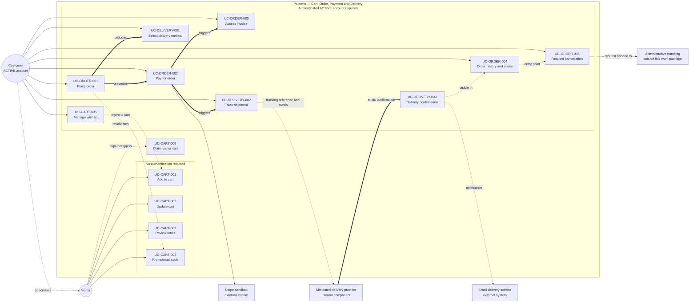
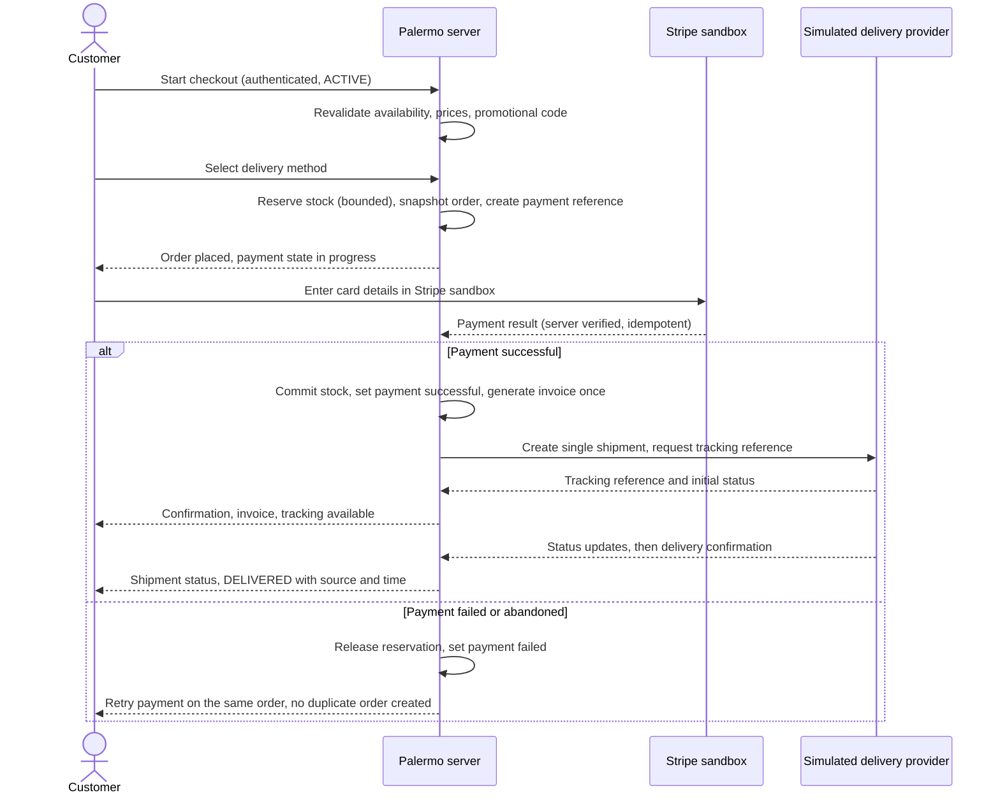

# Cart, Order, Payment and Delivery — Use-Case Specification

## Status

**Validated team SRS refinement for the cart, order, payment, and delivery work package.**

Specifies the use cases for `FR-CART-001`–`FR-CART-005`, `FR-ORDER-001`–`FR-ORDER-004`, and `FR-DELIVERY-001`–`FR-DELIVERY-003`, bounded by approved decisions `D-011` and `D-034`–`D-047`. Details not determined by the Palermo brief or the decision register are recorded as explicit assumptions (§9) or downstream design items (§11), never as source-supplied behaviour.

**Canonical references:** `docs/requirements/functional-requirements.md`, `docs/requirements/decision-register.md`, `docs/requirements/actor-registry.md`
**Related deliverable:** `docs/ui/cart-order-delivery.md`
**Priority:** all twelve in-scope requirements are **MUST** — a development-team MoSCoW classification, not stated by the source document.

---

## 1. Actors and boundaries

| Actor | Type | Role here |
|---|---|---|
| **Visitor** | Business actor | Unauthenticated; maintains a temporary cart; cannot place an order. |
| **Customer** | Business actor | Owner of an `ACTIVE` account; checkout, payment, order management, tracking — own records only. |
| **Administrator** | Business actor | Out of scope except as recipient of a cancellation request (admin work package). |
| **Stripe sandbox** | External system | Collects card credentials, processes the test payment, returns a server-verifiable result. |
| **Simulated delivery provider** | Internal Palermo component | Demo tracking references, controlled status updates, delivery confirmation. Not an external actor (`actor-registry.md`). |
| **Email delivery service** | External system | Order/payment/delivery notifications only; content design is out of scope. |

### 1.1 Visitor versus Customer capability boundary

| Capability | Visitor | Customer (`ACTIVE`) | Decision |
|---|---|---|---|
| Add to cart, update quantity, remove line | Yes — temporary cart | Yes — account cart | `D-011` |
| See server-calculated cart totals | Yes | Yes | `D-034`, `D-035` |
| Enter a promotional code | Yes — subject to `ASM-COD-001` | Yes | `D-037` |
| Reserve stock by adding to cart | No | No | `D-036` |
| Manage a wishlist | No — account-specific | Yes | `D-011` |
| Start checkout / place an order | No — authentication required | Yes | `D-011` |
| Pay for an order | No | Yes — own order | `D-011`, `D-039` |
| Access a digital invoice | No | Yes — own paid order | `D-041` |
| View order history and status | No | Yes — own orders | `D-011` |
| Request order cancellation | No | Yes — own eligible order | `D-042` |
| Select a delivery method | No — chosen in checkout | Yes | `D-045` |
| Track a shipment / see delivery confirmation | No | Yes — own shipment | `D-046`, `D-047` |

**Guest checkout is not in baseline.** A Visitor attempting any order, payment, invoice, cancellation, tracking, or wishlist action is sent to authentication and resumes at the same point after sign-in.

---

## 2. State concepts

No new order-state enumeration is defined here. Only the state *concepts* required by `D-038`, `D-042`, `D-044`, and `D-047` are used; canonical enumerated values are deferred to data design (`ASM-COD-002`).

| Concept | Meaning | Decision |
|---|---|---|
| Order fulfilment state | Placed, cancellation requested, cancelled, dispatched, delivered. | `D-038` |
| Payment state | Not paid, payment in progress, payment successful, payment failed. | `D-038`, `D-039` |
| Pre-shipment | The order's single shipment has not been dispatched; governs cancellation eligibility. | `D-042`, `D-044` |
| Shipment record | Exactly one per baseline order, carrying tracking reference and status history. | `D-044`, `D-046` |
| `DELIVERED` | Terminal shipment status set by the provider's confirmation event. | `D-047` |

**Fulfilment state and payment state are separate.** An order may be *placed* while payment is still *in progress* or *failed*. No behaviour here merges the two.

---

## 3. Shared business rules

| ID | Rule | Decision |
|---|---|---|
| `BR-COD-001` | Server is authoritative for price, availability, discount, delivery charge, and totals; client-submitted monetary values are never trusted or used. | `D-034`, `D-082` |
| `BR-COD-002` | Carts do not reserve stock; cart availability is informational and revalidated at checkout. | `D-036` |
| `BR-COD-003` | Order placement requires an authenticated `ACTIVE` account; no guest checkout. | `D-011` |
| `BR-COD-004` | A cart line = one sellable variant + its customisation set; differing customisations form distinct lines. | `D-027`, `D-034` |
| `BR-COD-005` | Cart pricing is live and server-recalculated; prices, discounts, delivery charge, and totals are snapshotted immutably at placement and never recalculated after. | `D-035` |
| `BR-COD-006` | Promotional-code eligibility and discount are server-validated on apply and revalidated at placement; the applied discount is snapshotted. | `D-037` |
| `BR-COD-007` | Fulfilment state and payment state are recorded and transitioned independently. | `D-038` |
| `BR-COD-008` | Card credentials are collected and processed by the Stripe sandbox. Palermo stores only payment references and status — never raw card numbers, CVV/CVC, or full card data — and verifies provider results server-side, never trusting the browser. | `D-039`, `D-083`, `D-085` |
| `BR-COD-009` | Repeated submission, retry, refresh, replay, or repeated provider callback must not duplicate an order, stock deduction, confirmed payment, invoice, shipment, or cancellation request. Idempotency uses persistent transaction identity, database constraints, and atomic processing — not process-local checks. | `D-040`, `D-043`, `D-096` |
| `BR-COD-010` | An invoice is generated only after a server-verified successful payment, from immutable snapshots. | `D-041` |
| `BR-COD-011` | Cancellation is a recorded request on an eligible pre-shipment order — not deletion. No refund, credit, or financial remedy is defined here. | `D-042` |
| `BR-COD-012` | Exactly one shipment record per order; split shipments and partial fulfilment excluded. | `D-044` |
| `BR-COD-013` | The customer selects an active configured delivery method; method, charge, and displayed delivery information are snapshotted onto the order. | `D-045` |
| `BR-COD-014` | Tracking references and status updates come from the internal simulated delivery provider behind a replaceable abstraction; no carrier API. | `D-046`, `D-093` |
| `BR-COD-015` | Delivery confirmation originates from the simulated provider, transitions an eligible shipment to `DELIVERED` once, and preserves confirmation source and time. Manual DB editing is not the normal workflow. | `D-047` |
| `BR-COD-016` | Stock is reserved only within a bounded checkout/payment window, using atomic controls, and released on failure, abandonment, or expiry. | `D-036`, `D-072` |
| `BR-COD-017` | A customer may read and act on their own orders, invoices, shipments, and cancellation requests only; ownership is enforced server-side on every request. | `D-049`, `D-099` |
| `BR-COD-018` | Failure messages state the problem and next action without exposing provider internals, stack traces, internal identifiers, or configuration. | `D-085`, `NFR-ERROR-001` |

---

## 4. Use-case index

| Use case | Actor | Requirements |
|---|---|---|
| `UC-CART-001` Add Sellable Variant to Cart | Visitor, Customer | `FR-CART-001` |
| `UC-CART-002` Update Cart Contents | Visitor, Customer | `FR-CART-002` |
| `UC-CART-003` Review Cart Totals | Visitor, Customer | `FR-CART-003` |
| `UC-CART-004` Apply or Remove Promotional Code | Visitor, Customer | `FR-CART-004` |
| `UC-CART-005` Manage Wishlist | Customer | `FR-CART-005` |
| `UC-CART-006` Claim Temporary Visitor Cart | Visitor → Customer | `FR-CART-001`–`FR-CART-003` |
| `UC-ORDER-001` Place Order | Customer | `FR-ORDER-001` |
| `UC-ORDER-002` Pay for Order | Customer | `FR-ORDER-002` |
| `UC-ORDER-003` Access Digital Invoice | Customer | `FR-ORDER-003` |
| `UC-ORDER-004` View Order History and Status | Customer | `FR-ORDER-001`, `FR-ORDER-003`, `FR-ORDER-004`, `FR-DELIVERY-002` |
| `UC-ORDER-005` Request Order Cancellation | Customer | `FR-ORDER-004` |
| `UC-DELIVERY-001` Select Delivery Method | Customer | `FR-DELIVERY-001` |
| `UC-DELIVERY-002` Track Shipment | Customer | `FR-DELIVERY-002` |
| `UC-DELIVERY-003` Record and Present Delivery Confirmation | Simulated delivery provider, Customer | `FR-DELIVERY-003` |

`UC-CART-006` and `UC-ORDER-004` are supporting use cases required by `D-011` and by customer access to order state. Neither introduces a new requirement or a new order behaviour.

### 4.1 Use-case diagram

**Notation.** Solid arrows are actor associations. Thick arrows are `«include»` and defined sequence relationships. Dotted arrows are supporting, derived, or boundary-crossing relationships. `UC-CART-006` sits between the two groups because it is triggered by successful authentication rather than invoked directly. The Customer specialises the Visitor: every Visitor cart capability is also a Customer capability (§1.1).

### 4.2 End-to-end journey

---

## 5. Cart use cases

### UC-CART-001 — Add Sellable Variant to Cart

**Actor** Visitor, Customer · **Req** `FR-CART-001` · **Decisions** `D-011`, `D-014`, `D-027`, `D-034`, `D-036` · **Rules** `BR-COD-001`, `BR-COD-002`, `BR-COD-004`, `BR-COD-005`
**Goal** Add a quantity of one sellable variant, with any eligible customisations, to the actor's cart.
**Preconditions** The actor has a cart context (temporary for a Visitor, account cart for a Customer); the variant exists and is sellable.
**Trigger** The actor confirms an add-to-cart action from a product, comparison, sample-set, or recommendation surface.

**Main flow**
1. Actor selects variant, quantity, and any permitted customisations.
2. Server validates that the variant is sellable and not archived, the quantity is a positive integer within the per-line limit, and each customisation is eligible for that variant.
3. Server identifies the line by variant + customisation set and creates a new line or increases the matching one.
4. Server recalculates totals and returns cart contents, totals, and current availability. No stock is reserved.

**Alternatives** **A1** matching line found → quantity increased, no second line. **A2** customisation set differs → separate line created. **A3** Visitor → line held on the temporary cart, later claimed by `UC-CART-006`.

**Exceptions** **E1** variant unsellable/archived → rejected, nothing added. **E2** invalid quantity → rejected, cart unchanged. **E3** ineligible customisation → rejected, offending selection identified. **E4** quantity above availability → availability reported, excess not added, nothing reserved (`BR-COD-002`). **E5** duplicate submission → quantity added once (`BR-COD-009`).

**Postconditions** *Success:* line present with server-calculated totals and no reservation. *Failure:* cart unchanged, actor told what to correct.

---

### UC-CART-002 — Update Cart Contents

**Actor** Visitor, Customer · **Req** `FR-CART-002` · **Decisions** `D-034`, `D-035`, `D-036` · **Rules** `BR-COD-001`, `BR-COD-002`, `BR-COD-004`, `BR-COD-005`
**Goal** Change a cart line's quantity, or remove a line, and obtain recalculated totals.
**Preconditions** Cart has at least one line; the targeted line belongs to the actor's own cart.
**Trigger** The actor changes a quantity or activates remove.

**Main flow**
1. Actor submits a new quantity or a removal for an identified line.
2. Server verifies line ownership and validates the quantity as a positive integer within the per-line limit.
3. Server applies the change, then revalidates all remaining lines against current price and availability.
4. Server recalculates totals including any applied discount (`UC-CART-004`) and returns the updated cart.

**Alternatives** **A1** quantity zero, where permitted → treated as removal. **A2** last line removed → cart empty, applied code cleared, totals zero. **A3** price changed since the line was added → current price used, actor informed.

**Exceptions** **E1** line not found or not owned → rejected without disclosing existence elsewhere. **E2** invalid quantity → rejected, previous quantity retained. **E3** quantity now above availability → availability reported, excess not applied. **E4** line became unsellable → flagged unavailable, excluded from the payable total, checkout blocked until resolved. **E5** duplicate or stale submission → does not compound; the last validated state is authoritative (`BR-COD-009`).

**Postconditions** *Success:* change applied with recalculated server totals, no reservation. *Failure:* previous validated state retained.

---

### UC-CART-003 — Review Cart Totals

**Actor** Visitor, Customer · **Req** `FR-CART-003` · **Decisions** `D-034`, `D-035`, `D-037`, `D-045` · **Rules** `BR-COD-001`, `BR-COD-002`, `BR-COD-005`, `BR-COD-006`
**Goal** Obtain a server-calculated breakdown: line subtotals, applied discount, payable total.
**Preconditions** The actor has a cart context.
**Trigger** The cart or mini-cart is opened, or any cart-mutating use case completes.

**Main flow**
1. Server loads the cart lines and resolves the current catalogue price for each variant.
2. Server calculates each line subtotal (current unit price × quantity, including any priced customisation) and the item subtotal.
3. Server applies any valid promotional discount from `UC-CART-004` and calculates the payable total.
4. Server returns the breakdown with per-line availability and price-change indicators.

**Alternatives** **A1** empty cart → zero totals, no discount. **A2** unavailable line present → shown but excluded from the payable total; checkout blocked until resolved. **A3** delivery charge not yet known → item total shown excluding delivery; the charge is added in `UC-DELIVERY-001` and finalised at placement.

**Exceptions** **E1** applied code no longer valid → discount dropped, total recalculated, actor informed. **E2** calculation cannot complete → no partial or client-computed total is shown; a retriable unavailable state is reported.

**Postconditions** *Success:* a server-authoritative total matching what checkout will use at that moment. *Failure:* no total presented as authoritative.

**Note** Cart totals are live and indicative; the binding values are the placement snapshots (`BR-COD-005`). Tax/GST treatment is not defined by this work package.

---

### UC-CART-004 — Apply or Remove Promotional Code

**Actor** Visitor, Customer · **Req** `FR-CART-004` · **Decisions** `D-037`, `D-078` · **Rules** `BR-COD-001`, `BR-COD-005`, `BR-COD-006`, `BR-COD-018` · **Assumption** `ASM-COD-001`
**Goal** Apply a server-validated promotional discount to the cart, or remove an applied code.
**Preconditions** Cart contains at least one sellable line.
**Trigger** The actor submits or removes a code.

**Main flow**
1. Actor enters a code; server normalises and resolves it against configured promotions.
2. Server validates that the promotion is active, in date, and satisfied by the cart contents and any configured eligibility rules.
3. Server calculates the discount, records the code as applied, and recalculates totals (`UC-CART-003`).
4. Server confirms the applied code and discount amount.

**Alternatives** **A1** remove → code cleared, totals recalculated. **A2** replace → a new code replaces the existing one; only one code applies at a time. **A3** cart changed after application → code re-evaluated and removed if it no longer qualifies, with the actor informed. **A4** revalidation at placement → `UC-ORDER-001` revalidates before snapshotting; an invalidated code is rejected there.

**Exceptions** **E1** unknown code → reported invalid, no hint about similar codes. **E2** expired or inactive → reported no longer available. **E3** eligibility not met → reported without exposing rule configuration. **E4** code requires customer identity and the actor is a Visitor → not applied, sign-in invited (`ASM-COD-001`). **E5** repeated submission → discounts do not stack; applied exactly once (`BR-COD-009`).

**Postconditions** *Success:* one valid code applied with a server-calculated discount in the total. *Failure:* no discount applied, total unchanged.

---

### UC-CART-005 — Manage Wishlist

**Actor** Customer · **Req** `FR-CART-005` · **Decisions** `D-011`, `D-013`, `D-014` · **Rules** `BR-COD-002`, `BR-COD-017`
**Goal** Save a perfume for later, view saved items, remove one, or move one to the cart.
**Preconditions** Authenticated `ACTIVE` customer account.
**Trigger** The actor saves an item, opens the wishlist, or acts on an entry.

**Main flow**
1. Actor activates save on a perfume or variant; server verifies the account and the item.
2. Server records the item on the customer's own wishlist, once, and confirms the saved state.
3. On opening the wishlist, server returns saved items with current availability and price.
4. Actor may remove an entry or move it to the cart, invoking `UC-CART-001`.

**Alternatives** **A1** already saved → single entry retained, reported as already saved. **A2** move to cart → entry optionally removed on a successful add; retained if the add fails. **A3** Visitor attempt → sign-in prompted; the intent may be replayed after authentication.

**Exceptions** **E1** item archived/unavailable → entry retained but marked unavailable and not movable to cart. **E2** entry not owned → rejected server-side (`BR-COD-017`). **E3** capacity limit reached → limit reported, item not saved.

**Postconditions** *Success:* wishlist reflects the change; no stock reserved. *Failure:* wishlist unchanged.

---

### UC-CART-006 — Claim Temporary Visitor Cart

**Actor** Visitor becoming an authenticated Customer · **Level** Supporting · **Req** `FR-CART-001`–`FR-CART-003` · **Decisions** `D-011`, `D-034` · **Rules** `BR-COD-001`, `BR-COD-002`, `BR-COD-004`, `BR-COD-005`, `BR-COD-009` · **Assumption** `ASM-COD-003`
**Goal** Carry a temporary visitor cart into the authenticated customer's account cart.
**Preconditions** A non-empty temporary cart exists; authentication succeeds for an `ACTIVE` account.
**Trigger** Successful sign-in, or first sign-in after registration, while a non-empty temporary cart exists.

**Main flow**
1. Server detects the non-empty visitor cart and loads the customer's existing account cart, if any.
2. Lines are matched on variant + customisation set; matches are combined subject to the per-line limit, non-matches are added.
3. Server revalidates every resulting line against current price and availability.
4. Server recalculates totals, re-evaluates any applied code, discards the temporary cart, and confirms the merged cart.

**Alternatives** **A1** empty account cart → all visitor lines transfer unchanged. **A2** empty visitor cart → no action. **A3** combined quantity above the per-line limit → line capped, customer told which line. **A4** code carried from the visitor cart → re-evaluated against the merged cart and authenticated identity; removed with an explanation if it no longer qualifies.

**Exceptions** **E1** line no longer sellable → transferred as unavailable, excluded from totals, blocks checkout until removed. **E2** merge interrupted or retried → applied once, no duplicated lines or quantities (`BR-COD-009`).

**Postconditions** *Success:* one account cart, no temporary cart, totals recalculated. *Failure:* account cart retains its previous validated state; customer told visitor items could not be transferred.

---