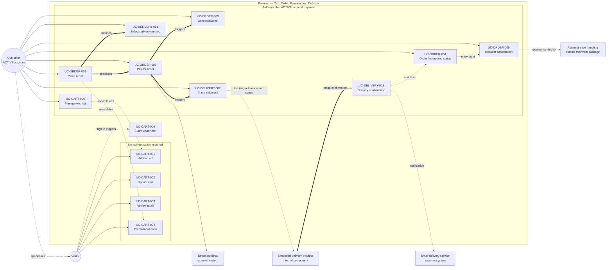
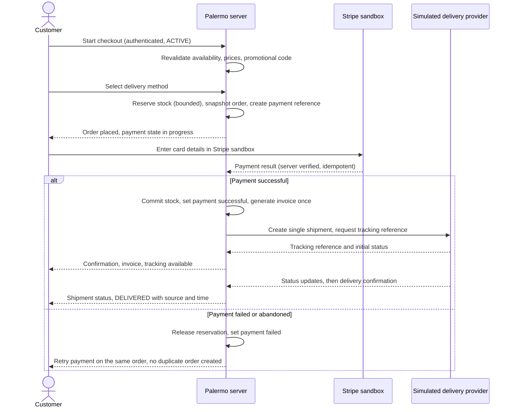

# Cart, Order, Payment and Delivery — Use-Case Specification

## Status

**Validated team SRS refinement for the cart, order, payment, and delivery work package.**

Specifies the use cases for `FR-CART-001`–`FR-CART-005`, `FR-ORDER-001`–`FR-ORDER-004`, and `FR-DELIVERY-001`–`FR-DELIVERY-003`, bounded by approved decisions `D-011` and `D-034`–`D-047`. Details not determined by the Palermo brief or the decision register are recorded as explicit assumptions (§9) or downstream design items (§11), never as source-supplied behaviour.

**Canonical references:** `docs/requirements/functional-requirements.md`, `docs/requirements/decision-register.md`, `docs/requirements/actor-registry.md`
**Related deliverable:** `docs/ui/cart-order-delivery.md`
**Priority:** all twelve in-scope requirements are **MUST** — a development-team MoSCoW classification, not stated by the source document.

---

## 1. Actors and boundaries

| Actor | Type | Role here |
|---|---|---|
| **Visitor** | Business actor | Unauthenticated; maintains a temporary cart; cannot place an order. |
| **Customer** | Business actor | Owner of an `ACTIVE` account; checkout, payment, order management, tracking — own records only. |
| **Administrator** | Business actor | Out of scope except as recipient of a cancellation request (admin work package). |
| **Stripe sandbox** | External system | Collects card credentials, processes the test payment, returns a server-verifiable result. |
| **Simulated delivery provider** | Internal Palermo component | Demo tracking references, controlled status updates, delivery confirmation. Not an external actor (`actor-registry.md`). |
| **Email delivery service** | External system | Order/payment/delivery notifications only; content design is out of scope. |

### 1.1 Visitor versus Customer capability boundary

| Capability | Visitor | Customer (`ACTIVE`) | Decision |
|---|---|---|---|
| Add to cart, update quantity, remove line | Yes — temporary cart | Yes — account cart | `D-011` |
| See server-calculated cart totals | Yes | Yes | `D-034`, `D-035` |
| Enter a promotional code | Yes — subject to `ASM-COD-001` | Yes | `D-037` |
| Reserve stock by adding to cart | No | No | `D-036` |
| Manage a wishlist | No — account-specific | Yes | `D-011` |
| Start checkout / place an order | No — authentication required | Yes | `D-011` |
| Pay for an order | No | Yes — own order | `D-011`, `D-039` |
| Access a digital invoice | No | Yes — own paid order | `D-041` |
| View order history and status | No | Yes — own orders | `D-011` |
| Request order cancellation | No | Yes — own eligible order | `D-042` |
| Select a delivery method | No — chosen in checkout | Yes | `D-045` |
| Track a shipment / see delivery confirmation | No | Yes — own shipment | `D-046`, `D-047` |

**Guest checkout is not in baseline.** A Visitor attempting any order, payment, invoice, cancellation, tracking, or wishlist action is sent to authentication and resumes at the same point after sign-in.

---

## 2. State concepts

No new order-state enumeration is defined here. Only the state *concepts* required by `D-038`, `D-042`, `D-044`, and `D-047` are used; canonical enumerated values are deferred to data design (`ASM-COD-002`).

| Concept | Meaning | Decision |
|---|---|---|
| Order fulfilment state | Placed, cancellation requested, cancelled, dispatched, delivered. | `D-038` |
| Payment state | Not paid, payment in progress, payment successful, payment failed. | `D-038`, `D-039` |
| Pre-shipment | The order's single shipment has not been dispatched; governs cancellation eligibility. | `D-042`, `D-044` |
| Shipment record | Exactly one per baseline order, carrying tracking reference and status history. | `D-044`, `D-046` |
| `DELIVERED` | Terminal shipment status set by the provider's confirmation event. | `D-047` |

**Fulfilment state and payment state are separate.** An order may be *placed* while payment is still *in progress* or *failed*. No behaviour here merges the two.

---

## 3. Shared business rules

| ID | Rule | Decision |
|---|---|---|
| `BR-COD-001` | Server is authoritative for price, availability, discount, delivery charge, and totals; client-submitted monetary values are never trusted or used. | `D-034`, `D-082` |
| `BR-COD-002` | Carts do not reserve stock; cart availability is informational and revalidated at checkout. | `D-036` |
| `BR-COD-003` | Order placement requires an authenticated `ACTIVE` account; no guest checkout. | `D-011` |
| `BR-COD-004` | A cart line = one sellable variant + its customisation set; differing customisations form distinct lines. | `D-027`, `D-034` |
| `BR-COD-005` | Cart pricing is live and server-recalculated; prices, discounts, delivery charge, and totals are snapshotted immutably at placement and never recalculated after. | `D-035` |
| `BR-COD-006` | Promotional-code eligibility and discount are server-validated on apply and revalidated at placement; the applied discount is snapshotted. | `D-037` |
| `BR-COD-007` | Fulfilment state and payment state are recorded and transitioned independently. | `D-038` |
| `BR-COD-008` | Card credentials are collected and processed by the Stripe sandbox. Palermo stores only payment references and status — never raw card numbers, CVV/CVC, or full card data — and verifies provider results server-side, never trusting the browser. | `D-039`, `D-083`, `D-085` |
| `BR-COD-009` | Repeated submission, retry, refresh, replay, or repeated provider callback must not duplicate an order, stock deduction, confirmed payment, invoice, shipment, or cancellation request. Idempotency uses persistent transaction identity, database constraints, and atomic processing — not process-local checks. | `D-040`, `D-043`, `D-096` |
| `BR-COD-010` | An invoice is generated only after a server-verified successful payment, from immutable snapshots. | `D-041` |
| `BR-COD-011` | Cancellation is a recorded request on an eligible pre-shipment order — not deletion. No refund, credit, or financial remedy is defined here. | `D-042` |
| `BR-COD-012` | Exactly one shipment record per order; split shipments and partial fulfilment excluded. | `D-044` |
| `BR-COD-013` | The customer selects an active configured delivery method; method, charge, and displayed delivery information are snapshotted onto the order. | `D-045` |
| `BR-COD-014` | Tracking references and status updates come from the internal simulated delivery provider behind a replaceable abstraction; no carrier API. | `D-046`, `D-093` |
| `BR-COD-015` | Delivery confirmation originates from the simulated provider, transitions an eligible shipment to `DELIVERED` once, and preserves confirmation source and time. Manual DB editing is not the normal workflow. | `D-047` |
| `BR-COD-016` | Stock is reserved only within a bounded checkout/payment window, using atomic controls, and released on failure, abandonment, or expiry. | `D-036`, `D-072` |
| `BR-COD-017` | A customer may read and act on their own orders, invoices, shipments, and cancellation requests only; ownership is enforced server-side on every request. | `D-049`, `D-099` |
| `BR-COD-018` | Failure messages state the problem and next action without exposing provider internals, stack traces, internal identifiers, or configuration. | `D-085`, `NFR-ERROR-001` |

---

## 4. Use-case index

| Use case | Actor | Requirements |
|---|---|---|
| `UC-CART-001` Add Sellable Variant to Cart | Visitor, Customer | `FR-CART-001` |
| `UC-CART-002` Update Cart Contents | Visitor, Customer | `FR-CART-002` |
| `UC-CART-003` Review Cart Totals | Visitor, Customer | `FR-CART-003` |
| `UC-CART-004` Apply or Remove Promotional Code | Visitor, Customer | `FR-CART-004` |
| `UC-CART-005` Manage Wishlist | Customer | `FR-CART-005` |
| `UC-CART-006` Claim Temporary Visitor Cart | Visitor → Customer | `FR-CART-001`–`FR-CART-003` |
| `UC-ORDER-001` Place Order | Customer | `FR-ORDER-001` |
| `UC-ORDER-002` Pay for Order | Customer | `FR-ORDER-002` |
| `UC-ORDER-003` Access Digital Invoice | Customer | `FR-ORDER-003` |
| `UC-ORDER-004` View Order History and Status | Customer | `FR-ORDER-001`, `FR-ORDER-003`, `FR-ORDER-004`, `FR-DELIVERY-002` |
| `UC-ORDER-005` Request Order Cancellation | Customer | `FR-ORDER-004` |
| `UC-DELIVERY-001` Select Delivery Method | Customer | `FR-DELIVERY-001` |
| `UC-DELIVERY-002` Track Shipment | Customer | `FR-DELIVERY-002` |
| `UC-DELIVERY-003` Record and Present Delivery Confirmation | Simulated delivery provider, Customer | `FR-DELIVERY-003` |

`UC-CART-006` and `UC-ORDER-004` are supporting use cases required by `D-011` and by customer access to order state. Neither introduces a new requirement or a new order behaviour.

### 4.1 Use-case diagram

**Notation.** Solid arrows are actor associations. Thick arrows are `«include»` and defined sequence relationships. Dotted arrows are supporting, derived, or boundary-crossing relationships. `UC-CART-006` sits between the two groups because it is triggered by successful authentication rather than invoked directly. The Customer specialises the Visitor: every Visitor cart capability is also a Customer capability (§1.1).

### 4.2 End-to-end journey

