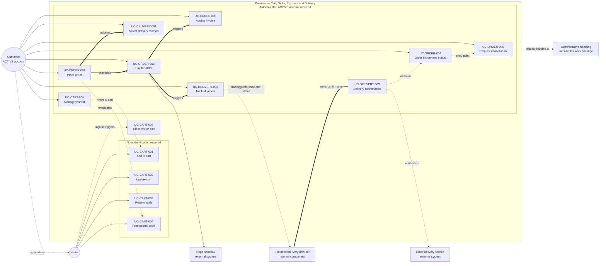
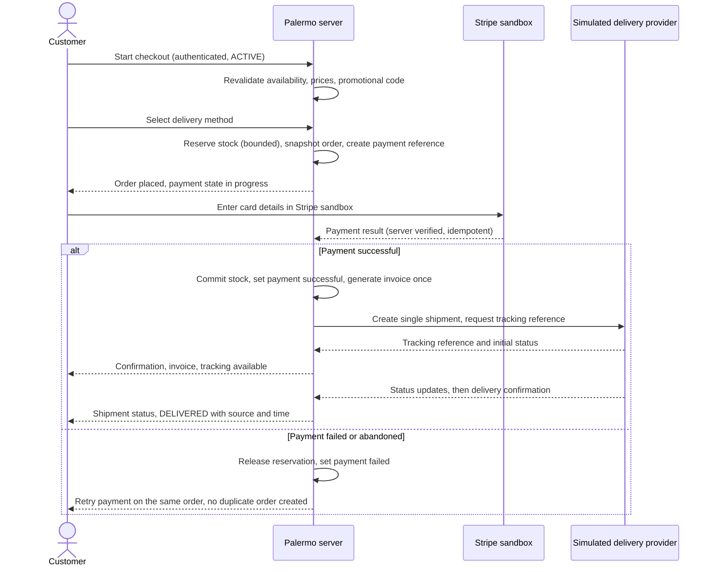

# Cart, Order, Payment and Delivery — Use-Case Specification

## Status

**Validated team SRS refinement for the cart, order, payment, and delivery work package.**

Specifies the use cases for `FR-CART-001`–`FR-CART-005`, `FR-ORDER-001`–`FR-ORDER-004`, and `FR-DELIVERY-001`–`FR-DELIVERY-003`, bounded by approved decisions `D-011` and `D-034`–`D-047`. Details not determined by the Palermo brief or the decision register are recorded as explicit assumptions (§9) or downstream design items (§11), never as source-supplied behaviour.

**Canonical references:** `docs/requirements/functional-requirements.md`, `docs/requirements/decision-register.md`, `docs/requirements/actor-registry.md`
**Related deliverable:** `docs/ui/cart-order-delivery.md`
**Priority:** all twelve in-scope requirements are **MUST** — a development-team MoSCoW classification, not stated by the source document.

---

## 1. Actors and boundaries

| Actor | Type | Role here |
|---|---|---|
| **Visitor** | Business actor | Unauthenticated; maintains a temporary cart; cannot place an order. |
| **Customer** | Business actor | Owner of an `ACTIVE` account; checkout, payment, order management, tracking — own records only. |
| **Administrator** | Business actor | Out of scope except as recipient of a cancellation request (admin work package). |
| **Stripe sandbox** | External system | Collects card credentials, processes the test payment, returns a server-verifiable result. |
| **Simulated delivery provider** | Internal Palermo component | Demo tracking references, controlled status updates, delivery confirmation. Not an external actor (`actor-registry.md`). |
| **Email delivery service** | External system | Order/payment/delivery notifications only; content design is out of scope. |

### 1.1 Visitor versus Customer capability boundary

| Capability | Visitor | Customer (`ACTIVE`) | Decision |
|---|---|---|---|
| Add to cart, update quantity, remove line | Yes — temporary cart | Yes — account cart | `D-011` |
| See server-calculated cart totals | Yes | Yes | `D-034`, `D-035` |
| Enter a promotional code | Yes — subject to `ASM-COD-001` | Yes | `D-037` |
| Reserve stock by adding to cart | No | No | `D-036` |
| Manage a wishlist | No — account-specific | Yes | `D-011` |
| Start checkout / place an order | No — authentication required | Yes | `D-011` |
| Pay for an order | No | Yes — own order | `D-011`, `D-039` |
| Access a digital invoice | No | Yes — own paid order | `D-041` |
| View order history and status | No | Yes — own orders | `D-011` |
| Request order cancellation | No | Yes — own eligible order | `D-042` |
| Select a delivery method | No — chosen in checkout | Yes | `D-045` |
| Track a shipment / see delivery confirmation | No | Yes — own shipment | `D-046`, `D-047` |

**Guest checkout is not in baseline.** A Visitor attempting any order, payment, invoice, cancellation, tracking, or wishlist action is sent to authentication and resumes at the same point after sign-in.

---

## 2. State concepts

No new order-state enumeration is defined here. Only the state *concepts* required by `D-038`, `D-042`, `D-044`, and `D-047` are used; canonical enumerated values are deferred to data design (`ASM-COD-002`).

| Concept | Meaning | Decision |
|---|---|---|
| Order fulfilment state | Placed, cancellation requested, cancelled, dispatched, delivered. | `D-038` |
| Payment state | Not paid, payment in progress, payment successful, payment failed. | `D-038`, `D-039` |
| Pre-shipment | The order's single shipment has not been dispatched; governs cancellation eligibility. | `D-042`, `D-044` |
| Shipment record | Exactly one per baseline order, carrying tracking reference and status history. | `D-044`, `D-046` |
| `DELIVERED` | Terminal shipment status set by the provider's confirmation event. | `D-047` |

**Fulfilment state and payment state are separate.** An order may be *placed* while payment is still *in progress* or *failed*. No behaviour here merges the two.

---

## 3. Shared business rules

| ID | Rule | Decision |
|---|---|---|
| `BR-COD-001` | Server is authoritative for price, availability, discount, delivery charge, and totals; client-submitted monetary values are never trusted or used. | `D-034`, `D-082` |
| `BR-COD-002` | Carts do not reserve stock; cart availability is informational and revalidated at checkout. | `D-036` |
| `BR-COD-003` | Order placement requires an authenticated `ACTIVE` account; no guest checkout. | `D-011` |
| `BR-COD-004` | A cart line = one sellable variant + its customisation set; differing customisations form distinct lines. | `D-027`, `D-034` |
| `BR-COD-005` | Cart pricing is live and server-recalculated; prices, discounts, delivery charge, and totals are snapshotted immutably at placement and never recalculated after. | `D-035` |
| `BR-COD-006` | Promotional-code eligibility and discount are server-validated on apply and revalidated at placement; the applied discount is snapshotted. | `D-037` |
| `BR-COD-007` | Fulfilment state and payment state are recorded and transitioned independently. | `D-038` |
| `BR-COD-008` | Card credentials are collected and processed by the Stripe sandbox. Palermo stores only payment references and status — never raw card numbers, CVV/CVC, or full card data — and verifies provider results server-side, never trusting the browser. | `D-039`, `D-083`, `D-085` |
| `BR-COD-009` | Repeated submission, retry, refresh, replay, or repeated provider callback must not duplicate an order, stock deduction, confirmed payment, invoice, shipment, or cancellation request. Idempotency uses persistent transaction identity, database constraints, and atomic processing — not process-local checks. | `D-040`, `D-043`, `D-096` |
| `BR-COD-010` | An invoice is generated only after a server-verified successful payment, from immutable snapshots. | `D-041` |
| `BR-COD-011` | Cancellation is a recorded request on an eligible pre-shipment order — not deletion. No refund, credit, or financial remedy is defined here. | `D-042` |
| `BR-COD-012` | Exactly one shipment record per order; split shipments and partial fulfilment excluded. | `D-044` |
| `BR-COD-013` | The customer selects an active configured delivery method; method, charge, and displayed delivery information are snapshotted onto the order. | `D-045` |
| `BR-COD-014` | Tracking references and status updates come from the internal simulated delivery provider behind a replaceable abstraction; no carrier API. | `D-046`, `D-093` |
| `BR-COD-015` | Delivery confirmation originates from the simulated provider, transitions an eligible shipment to `DELIVERED` once, and preserves confirmation source and time. Manual DB editing is not the normal workflow. | `D-047` |
| `BR-COD-016` | Stock is reserved only within a bounded checkout/payment window, using atomic controls, and released on failure, abandonment, or expiry. | `D-036`, `D-072` |
| `BR-COD-017` | A customer may read and act on their own orders, invoices, shipments, and cancellation requests only; ownership is enforced server-side on every request. | `D-049`, `D-099` |
| `BR-COD-018` | Failure messages state the problem and next action without exposing provider internals, stack traces, internal identifiers, or configuration. | `D-085`, `NFR-ERROR-001` |

---

## 4. Use-case index

| Use case | Actor | Requirements |
|---|---|---|
| `UC-CART-001` Add Sellable Variant to Cart | Visitor, Customer | `FR-CART-001` |
| `UC-CART-002` Update Cart Contents | Visitor, Customer | `FR-CART-002` |
| `UC-CART-003` Review Cart Totals | Visitor, Customer | `FR-CART-003` |
| `UC-CART-004` Apply or Remove Promotional Code | Visitor, Customer | `FR-CART-004` |
| `UC-CART-005` Manage Wishlist | Customer | `FR-CART-005` |
| `UC-CART-006` Claim Temporary Visitor Cart | Visitor → Customer | `FR-CART-001`–`FR-CART-003` |
| `UC-ORDER-001` Place Order | Customer | `FR-ORDER-001` |
| `UC-ORDER-002` Pay for Order | Customer | `FR-ORDER-002` |
| `UC-ORDER-003` Access Digital Invoice | Customer | `FR-ORDER-003` |
| `UC-ORDER-004` View Order History and Status | Customer | `FR-ORDER-001`, `FR-ORDER-003`, `FR-ORDER-004`, `FR-DELIVERY-002` |
| `UC-ORDER-005` Request Order Cancellation | Customer | `FR-ORDER-004` |
| `UC-DELIVERY-001` Select Delivery Method | Customer | `FR-DELIVERY-001` |
| `UC-DELIVERY-002` Track Shipment | Customer | `FR-DELIVERY-002` |
| `UC-DELIVERY-003` Record and Present Delivery Confirmation | Simulated delivery provider, Customer | `FR-DELIVERY-003` |

`UC-CART-006` and `UC-ORDER-004` are supporting use cases required by `D-011` and by customer access to order state. Neither introduces a new requirement or a new order behaviour.

### 4.1 Use-case diagram

**Notation.** Solid arrows are actor associations. Thick arrows are `«include»` and defined sequence relationships. Dotted arrows are supporting, derived, or boundary-crossing relationships. `UC-CART-006` sits between the two groups because it is triggered by successful authentication rather than invoked directly. The Customer specialises the Visitor: every Visitor cart capability is also a Customer capability (§1.1).

### 4.2 End-to-end journey

---

## 5. Cart use cases

### UC-CART-001 — Add Sellable Variant to Cart

**Actor** Visitor, Customer · **Req** `FR-CART-001` · **Decisions** `D-011`, `D-014`, `D-027`, `D-034`, `D-036` · **Rules** `BR-COD-001`, `BR-COD-002`, `BR-COD-004`, `BR-COD-005`
**Goal** Add a quantity of one sellable variant, with any eligible customisations, to the actor's cart.
**Preconditions** The actor has a cart context (temporary for a Visitor, account cart for a Customer); the variant exists and is sellable.
**Trigger** The actor confirms an add-to-cart action from a product, comparison, sample-set, or recommendation surface.

**Main flow**
1. Actor selects variant, quantity, and any permitted customisations.
2. Server validates that the variant is sellable and not archived, the quantity is a positive integer within the per-line limit, and each customisation is eligible for that variant.
3. Server identifies the line by variant + customisation set and creates a new line or increases the matching one.
4. Server recalculates totals and returns cart contents, totals, and current availability. No stock is reserved.

**Alternatives** **A1** matching line found → quantity increased, no second line. **A2** customisation set differs → separate line created. **A3** Visitor → line held on the temporary cart, later claimed by `UC-CART-006`.

**Exceptions** **E1** variant unsellable/archived → rejected, nothing added. **E2** invalid quantity → rejected, cart unchanged. **E3** ineligible customisation → rejected, offending selection identified. **E4** quantity above availability → availability reported, excess not added, nothing reserved (`BR-COD-002`). **E5** duplicate submission → quantity added once (`BR-COD-009`).

**Postconditions** *Success:* line present with server-calculated totals and no reservation. *Failure:* cart unchanged, actor told what to correct.

---

### UC-CART-002 — Update Cart Contents

**Actor** Visitor, Customer · **Req** `FR-CART-002` · **Decisions** `D-034`, `D-035`, `D-036` · **Rules** `BR-COD-001`, `BR-COD-002`, `BR-COD-004`, `BR-COD-005`
**Goal** Change a cart line's quantity, or remove a line, and obtain recalculated totals.
**Preconditions** Cart has at least one line; the targeted line belongs to the actor's own cart.
**Trigger** The actor changes a quantity or activates remove.

**Main flow**
1. Actor submits a new quantity or a removal for an identified line.
2. Server verifies line ownership and validates the quantity as a positive integer within the per-line limit.
3. Server applies the change, then revalidates all remaining lines against current price and availability.
4. Server recalculates totals including any applied discount (`UC-CART-004`) and returns the updated cart.

**Alternatives** **A1** quantity zero, where permitted → treated as removal. **A2** last line removed → cart empty, applied code cleared, totals zero. **A3** price changed since the line was added → current price used, actor informed.

**Exceptions** **E1** line not found or not owned → rejected without disclosing existence elsewhere. **E2** invalid quantity → rejected, previous quantity retained. **E3** quantity now above availability → availability reported, excess not applied. **E4** line became unsellable → flagged unavailable, excluded from the payable total, checkout blocked until resolved. **E5** duplicate or stale submission → does not compound; the last validated state is authoritative (`BR-COD-009`).

**Postconditions** *Success:* change applied with recalculated server totals, no reservation. *Failure:* previous validated state retained.

---

### UC-CART-003 — Review Cart Totals

**Actor** Visitor, Customer · **Req** `FR-CART-003` · **Decisions** `D-034`, `D-035`, `D-037`, `D-045` · **Rules** `BR-COD-001`, `BR-COD-002`, `BR-COD-005`, `BR-COD-006`
**Goal** Obtain a server-calculated breakdown: line subtotals, applied discount, payable total.
**Preconditions** The actor has a cart context.
**Trigger** The cart or mini-cart is opened, or any cart-mutating use case completes.

**Main flow**
1. Server loads the cart lines and resolves the current catalogue price for each variant.
2. Server calculates each line subtotal (current unit price × quantity, including any priced customisation) and the item subtotal.
3. Server applies any valid promotional discount from `UC-CART-004` and calculates the payable total.
4. Server returns the breakdown with per-line availability and price-change indicators.

**Alternatives** **A1** empty cart → zero totals, no discount. **A2** unavailable line present → shown but excluded from the payable total; checkout blocked until resolved. **A3** delivery charge not yet known → item total shown excluding delivery; the charge is added in `UC-DELIVERY-001` and finalised at placement.

**Exceptions** **E1** applied code no longer valid → discount dropped, total recalculated, actor informed. **E2** calculation cannot complete → no partial or client-computed total is shown; a retriable unavailable state is reported.

**Postconditions** *Success:* a server-authoritative total matching what checkout will use at that moment. *Failure:* no total presented as authoritative.

**Note** Cart totals are live and indicative; the binding values are the placement snapshots (`BR-COD-005`). Tax/GST treatment is not defined by this work package.

---

### UC-CART-004 — Apply or Remove Promotional Code

**Actor** Visitor, Customer · **Req** `FR-CART-004` · **Decisions** `D-037`, `D-078` · **Rules** `BR-COD-001`, `BR-COD-005`, `BR-COD-006`, `BR-COD-018` · **Assumption** `ASM-COD-001`
**Goal** Apply a server-validated promotional discount to the cart, or remove an applied code.
**Preconditions** Cart contains at least one sellable line.
**Trigger** The actor submits or removes a code.

**Main flow**
1. Actor enters a code; server normalises and resolves it against configured promotions.
2. Server validates that the promotion is active, in date, and satisfied by the cart contents and any configured eligibility rules.
3. Server calculates the discount, records the code as applied, and recalculates totals (`UC-CART-003`).
4. Server confirms the applied code and discount amount.

**Alternatives** **A1** remove → code cleared, totals recalculated. **A2** replace → a new code replaces the existing one; only one code applies at a time. **A3** cart changed after application → code re-evaluated and removed if it no longer qualifies, with the actor informed. **A4** revalidation at placement → `UC-ORDER-001` revalidates before snapshotting; an invalidated code is rejected there.

**Exceptions** **E1** unknown code → reported invalid, no hint about similar codes. **E2** expired or inactive → reported no longer available. **E3** eligibility not met → reported without exposing rule configuration. **E4** code requires customer identity and the actor is a Visitor → not applied, sign-in invited (`ASM-COD-001`). **E5** repeated submission → discounts do not stack; applied exactly once (`BR-COD-009`).

**Postconditions** *Success:* one valid code applied with a server-calculated discount in the total. *Failure:* no discount applied, total unchanged.

---

### UC-CART-005 — Manage Wishlist

**Actor** Customer · **Req** `FR-CART-005` · **Decisions** `D-011`, `D-013`, `D-014` · **Rules** `BR-COD-002`, `BR-COD-017`
**Goal** Save a perfume for later, view saved items, remove one, or move one to the cart.
**Preconditions** Authenticated `ACTIVE` customer account.
**Trigger** The actor saves an item, opens the wishlist, or acts on an entry.

**Main flow**
1. Actor activates save on a perfume or variant; server verifies the account and the item.
2. Server records the item on the customer's own wishlist, once, and confirms the saved state.
3. On opening the wishlist, server returns saved items with current availability and price.
4. Actor may remove an entry or move it to the cart, invoking `UC-CART-001`.

**Alternatives** **A1** already saved → single entry retained, reported as already saved. **A2** move to cart → entry optionally removed on a successful add; retained if the add fails. **A3** Visitor attempt → sign-in prompted; the intent may be replayed after authentication.

**Exceptions** **E1** item archived/unavailable → entry retained but marked unavailable and not movable to cart. **E2** entry not owned → rejected server-side (`BR-COD-017`). **E3** capacity limit reached → limit reported, item not saved.

**Postconditions** *Success:* wishlist reflects the change; no stock reserved. *Failure:* wishlist unchanged.

---

### UC-CART-006 — Claim Temporary Visitor Cart

**Actor** Visitor becoming an authenticated Customer · **Level** Supporting · **Req** `FR-CART-001`–`FR-CART-003` · **Decisions** `D-011`, `D-034` · **Rules** `BR-COD-001`, `BR-COD-002`, `BR-COD-004`, `BR-COD-005`, `BR-COD-009` · **Assumption** `ASM-COD-003`
**Goal** Carry a temporary visitor cart into the authenticated customer's account cart.
**Preconditions** A non-empty temporary cart exists; authentication succeeds for an `ACTIVE` account.
**Trigger** Successful sign-in, or first sign-in after registration, while a non-empty temporary cart exists.

**Main flow**
1. Server detects the non-empty visitor cart and loads the customer's existing account cart, if any.
2. Lines are matched on variant + customisation set; matches are combined subject to the per-line limit, non-matches are added.
3. Server revalidates every resulting line against current price and availability.
4. Server recalculates totals, re-evaluates any applied code, discards the temporary cart, and confirms the merged cart.

**Alternatives** **A1** empty account cart → all visitor lines transfer unchanged. **A2** empty visitor cart → no action. **A3** combined quantity above the per-line limit → line capped, customer told which line. **A4** code carried from the visitor cart → re-evaluated against the merged cart and authenticated identity; removed with an explanation if it no longer qualifies.

**Exceptions** **E1** line no longer sellable → transferred as unavailable, excluded from totals, blocks checkout until removed. **E2** merge interrupted or retried → applied once, no duplicated lines or quantities (`BR-COD-009`).

**Postconditions** *Success:* one account cart, no temporary cart, totals recalculated. *Failure:* account cart retains its previous validated state; customer told visitor items could not be transferred.

---

## 6. Order and payment use cases

### UC-ORDER-001 — Place Order

**Actor** Customer · **Req** `FR-ORDER-001` · **Decisions** `D-004`, `D-011`, `D-035`–`D-038`, `D-040`, `D-043`, `D-044`, `D-045` · **Rules** `BR-COD-001`, `BR-COD-003`, `BR-COD-005`–`BR-COD-007`, `BR-COD-009`, `BR-COD-012`, `BR-COD-013`, `BR-COD-016` · **Includes** `UC-DELIVERY-001` · **Precedes** `UC-ORDER-002`
**Goal** Convert the validated cart into an immutable order record ready for payment.
**Preconditions** Authenticated `ACTIVE` account (`BR-COD-003`); cart has at least one sellable line; delivery and billing addresses exist or are supplied in checkout (`D-004`).
**Trigger** The customer confirms placement on the checkout review step.

**Main flow**
1. Server verifies the `ACTIVE` account and cart ownership.
2. Server revalidates every line (exists, sellable, not archived, sufficient stock) and resolves current prices.
3. Server revalidates the applied promotional code and recalculates the discount (`BR-COD-006`).
4. Server confirms the delivery and billing addresses, and the delivery method and charge from `UC-DELIVERY-001`.
5. Server calculates the final payable total and reserves stock within a bounded window using atomic controls (`BR-COD-016`).
6. Server creates one order carrying immutable snapshots of lines (variant, quantity, unit price, customisations), applied code and discount, delivery method and charge, both addresses, and the payable total.
7. Server sets fulfilment state *placed* and payment state *not paid*, independently (`BR-COD-007`), binds a persistent transaction identity (`BR-COD-009`), detaches the cart, and hands off to `UC-ORDER-002`.

**Alternatives** **A1** address supplied in checkout → the order stores an immutable snapshot of the address used (`D-004`). **A2** billing reuses delivery → the same values are snapshotted for both roles. **A3** code removed at revalidation → customer returned to review with the recalculated total and an explanation, and may confirm again.

**Exceptions** **E1** not authenticated or account not `ACTIVE` → refused, sent to authentication, no order created, no guest checkout (`BR-COD-003`). **E2** empty cart → refused. **E3** line no longer sellable → refused, line identified, customer returns to the cart. **E4** insufficient stock → refused, availability reported, nothing reserved. **E5** price changed since review → refused, recalculated total shown, explicit re-confirmation required before an order exists. **E6** no delivery method or method deactivated → refused, customer returns to `UC-DELIVERY-001`. **E7** missing required address → refused until a valid delivery address and a billing address (or explicit reuse) are present. **E8** duplicate placement submission → resolves to the single existing order; no second order, reservation, or stock deduction (`BR-COD-009`). **E9** placement not atomic → nothing partial persists (no order, no reservation, no cart clearance); retry offered.

**Postconditions** *Success:* one order with immutable pricing, discount, delivery, and address snapshots; stock reserved within a bounded window; fulfilment *placed*, payment *not paid*; no payment taken. *Failure:* no order, no reservation, cart still available for correction.

---

### UC-ORDER-002 — Pay for Order

**Actor** Customer · **Supporting** Stripe sandbox · **Req** `FR-ORDER-002` · **Decisions** `D-036`, `D-038`–`D-041`, `D-043`, `D-093` · **Rules** `BR-COD-007`–`BR-COD-010`, `BR-COD-016`–`BR-COD-018` · **Triggers** `UC-ORDER-003`, `UC-DELIVERY-002`
**Goal** Pay for a placed order via the Stripe sandbox and record a server-verified payment state on that order.
**Preconditions** A placed order owned by the authenticated customer (`BR-COD-017`); payment state *not paid* or *payment failed*; reservation window still valid.
**Trigger** The customer starts or retries payment.

**Main flow**
1. Server verifies the `ACTIVE` account, order ownership, payability, and a valid reservation window.
2. Server creates or reuses a Stripe sandbox payment intent for the snapshotted total, carrying a persistent transaction identity (`BR-COD-009`), and sets payment state *in progress* leaving fulfilment state unchanged (`BR-COD-007`).
3. Customer enters card details directly into the Stripe sandbox payment element; Palermo never receives, stores, or logs them (`BR-COD-008`).
4. Server verifies the provider result server-side rather than trusting the browser response (`BR-COD-008`).
5. On verified success, in one atomic idempotent operation: payment state *successful*, reserved stock committed once, payment reference and status recorded, invoice generated once (`UC-ORDER-003`).
6. Server creates the single shipment and requests a tracking reference from the simulated provider (`UC-DELIVERY-002`, `BR-COD-012`), then confirms the outcome to the customer.

**Alternatives** **A1** asynchronous provider confirmation → order shows *payment in progress* until the verified result is recorded; the customer is not asked to pay again while a result is pending. **A2** customer returns before the result is known → pending state shown, no second attempt created. **A3** retry after failure → a new attempt is recorded against the same order; no new order.

**Exceptions** **E1** declined/rejected → payment state *failed*, order and snapshots intact, reservation held until the bounded window expires then released (`BR-COD-016`), retry offered with a user-safe message (`BR-COD-018`). **E2** payment abandoned → state remains *not paid* or *in progress*, reservation released on expiry, no invoice. **E3** provider unavailable or timeout → nothing recorded as successful; retry offered, no provider internals disclosed. **E4** duplicate or replayed callback → exactly one confirmed payment, one stock commitment, one invoice, one shipment (`BR-COD-009`). **E5** reservation expired before success → availability revalidated before commit; if unavailable the order is not committed as fulfilled, the customer is informed, and the outcome follows the approved payment-exception process — no refund behaviour is defined here (`D-042` boundary). **E6** payment succeeds but downstream steps fail → the verified payment state is never lost; invoice and shipment creation retry idempotently to at most one each. **E7** order not owned → refused server-side (`BR-COD-017`).

**Postconditions** *Success:* payment state *successful* with a stored reference; stock committed once; exactly one invoice and one shipment; no raw card data stored anywhere in Palermo. *Failure:* order persists with an unsuccessful payment state, no invoice, no shipment; retry available on the same order.

---

### UC-ORDER-003 — Access Digital Invoice

**Actor** Customer · **Req** `FR-ORDER-003` · **Decisions** `D-004`, `D-035`, `D-039`, `D-041`, `D-100` · **Rules** `BR-COD-005`, `BR-COD-009`, `BR-COD-010`, `BR-COD-017`
**Goal** Obtain the invoice for an order whose payment succeeded.
**Preconditions** Order owned by the authenticated customer; payment state *successful*.
**Trigger** Successful payment generates the invoice; the customer later opens or downloads it.

**Main flow**
1. On verified successful payment, server generates exactly one invoice (`BR-COD-010`).
2. The invoice is composed from immutable snapshots: lines and unit prices, discount, delivery method and charge, payable total, billing address, payment reference and status.
3. Server records the invoice against the order with its identifier and issue time.
4. Customer requests it; server verifies ownership and returns the stored invoice.

**Alternatives** **A1** repeat access → the same document is returned unchanged. **A2** later profile/address edits → an issued invoice is unaffected (`D-004`, `BR-COD-005`). **A3** cancellation requested after payment → the invoice is retained as a historical record (`BR-COD-011`).

**Exceptions** **E1** payment not successful → no invoice exists and the action is unavailable (`BR-COD-010`). **E2** duplicate generation attempt → no second invoice (`BR-COD-009`). **E3** order not owned → refused server-side (`BR-COD-017`). **E4** document temporarily unavailable → retriable error; never regenerated with recalculated values.

**Postconditions** *Success:* exactly one immutable invoice, retrievable by its owning customer. *Failure:* no invoice created, no partial invoice presented.

**Note** The invoice carries the payment reference and status only — never raw card data (`BR-COD-008`). Tax/GST presentation is not defined here.

---

### UC-ORDER-004 — View Order History and Status

**Actor** Customer · **Req** `FR-ORDER-001`, `FR-ORDER-003`, `FR-ORDER-004`, `FR-DELIVERY-002` · **Decisions** `D-038`, `D-042`, `D-044`, `D-046`, `D-049`, `D-099` · **Rules** `BR-COD-007`, `BR-COD-012`, `BR-COD-017`
**Goal** Review own orders, their independent fulfilment and payment states, and the actions currently available.
**Preconditions** Authenticated `ACTIVE` customer account.
**Trigger** The customer opens order history or a single order.

**Main flow**
1. Server verifies the account and returns only orders owned by that customer (`BR-COD-017`).
2. Each order returns reference, placement time, snapshotted total, and fulfilment state and payment state as separate values (`BR-COD-007`).
3. On opening one order, server returns its immutable snapshots (lines, customisations, unit prices, discount, delivery method and charge, both addresses, total).
4. Server returns the order's single shipment with tracking reference and current status where one exists (`UC-DELIVERY-002`), and any recorded cancellation request and outcome (`UC-ORDER-005`).
5. Server offers only the currently permitted actions: retry payment, view invoice, track shipment, request cancellation.

**Alternatives** **A1** no orders → empty history with guidance to the catalogue. **A2** awaiting payment → unsuccessful payment state with a retry action; no invoice action. **A3** paid, not dispatched → invoice and cancellation-request actions offered; tracking shows a pre-dispatch status. **A4** delivered → shipment shows `DELIVERED` with confirmation source and time; no cancellation action.

**Exceptions** **E1** order not owned → refused server-side without revealing existence (`BR-COD-017`). **E2** shipment information unavailable → order and snapshots still shown; tracking reports a retriable error and no status is fabricated (`BR-COD-014`).

**Postconditions** *Success:* accurate ownership-scoped view with fulfilment and payment states shown separately. *Failure:* no other customer's data is exposed.

---

### UC-ORDER-005 — Request Order Cancellation

**Actor** Customer · **Req** `FR-ORDER-004` · **Decisions** `D-042`, `D-043`, `D-044`, `D-047` · **Rules** `BR-COD-009`, `BR-COD-011`, `BR-COD-012`, `BR-COD-017`, `BR-COD-018` · **Assumption** `ASM-COD-004`
**Goal** Record a cancellation request against an eligible pre-shipment order.
**Preconditions** Order owned by the authenticated customer; its single shipment is not dispatched; no request already open.
**Trigger** The customer submits a cancellation request from order detail.

**Main flow**
1. Server verifies ownership and re-evaluates eligibility at submission time.
2. Customer optionally supplies a reason from an approved list or free text.
3. Server records one request against the order with submission time, requesting customer, and reason.
4. Server sets fulfilment state *cancellation requested*, leaving payment state unchanged (`BR-COD-007`), and confirms that a request is recorded and awaiting a decision.
5. The request is made available to the administrative handling workflow defined outside this work package.

**Alternatives** **A1** unpaid order → request recorded; payment state unchanged, no invoice exists. **A2** paid order → request recorded; the invoice is retained and no refund, credit, or remedy is created or implied (`BR-COD-011`). **A3** outcome recorded → fulfilment state moves to *cancelled* or returns to its previous value, visible in `UC-ORDER-004`.

**Exceptions** **E1** already dispatched → refused as no longer pre-shipment; customer directed to support. **E2** already delivered or cancelled → action unavailable, nothing recorded. **E3** duplicate submission → exactly one open request (`BR-COD-009`). **E4** order not owned → refused server-side (`BR-COD-017`). **E5** eligibility changes between display and submission → re-evaluated at submission; refused with the current status if dispatched in the interim.

**Postconditions** *Success:* exactly one recorded request; order, snapshots, and any invoice preserved; nothing deleted (`BR-COD-011`). *Failure:* no request recorded, order unchanged.

**Boundary** This use case records a request only. It does not decide it, does not cancel a dispatched shipment, and defines no refund behaviour — all outside `D-042`.

---

## 7. Delivery use cases

### UC-DELIVERY-001 — Select Delivery Method

**Actor** Customer · **Req** `FR-DELIVERY-001` · **Decisions** `D-004`, `D-035`, `D-045` · **Rules** `BR-COD-001`, `BR-COD-005`, `BR-COD-013` · **Included by** `UC-ORDER-001`
**Goal** Choose one active configured delivery method and see its charge and displayed delivery information in the total.
**Preconditions** Authenticated `ACTIVE` customer in checkout; cart has at least one sellable line; at least one delivery method is configured and active.
**Trigger** The customer reaches the delivery step, or changes the method before placing the order.

**Main flow**
1. Server loads the delivery methods currently active and applicable to the order, each with its name, server-calculated charge, and displayed delivery information.
2. Customer selects one method; server records the selection against the checkout in progress.
3. Server recalculates the payable total including the delivery charge (`BR-COD-001`) and returns it for the review step.
4. At placement the method, charge, and displayed delivery information are snapshotted onto the order (`BR-COD-013`).

**Alternatives** **A1** single applicable method → preselected with its charge shown, still reviewable before placement. **A2** selection changed → replaces the previous one and recalculates; exactly one method applies per order. **A3** delivery address changed → applicability and charges re-evaluated before placement.

**Exceptions** **E1** no applicable active method → checkout cannot proceed; delivery reported unavailable and no order is placed. **E2** selected method deactivated before placement → selection cleared, re-selection required, placement refused (`UC-ORDER-001` E6). **E3** client-submitted delivery charge → ignored; only the server-calculated charge is used (`BR-COD-001`). **E4** method list unavailable → retriable error; placement never proceeds with an unpriced method.

**Postconditions** *Success:* exactly one active method selected, its server-calculated charge in the payable total, ready to snapshot at placement. *Failure:* no method selected and placement remains blocked.

**Boundary** Displayed delivery information is configured descriptive information, not a carrier commitment; no carrier API is involved (`BR-COD-014`).

---

### UC-DELIVERY-002 — Track Shipment

**Actor** Customer · **Supporting** Simulated delivery provider · **Req** `FR-DELIVERY-002` · **Decisions** `D-044`, `D-046`, `D-093` · **Rules** `BR-COD-012`, `BR-COD-014`, `BR-COD-017`, `BR-COD-018`
**Goal** See the tracking reference and status history for the single shipment of a paid order.
**Preconditions** Order owned by the authenticated customer; a shipment record exists.
**Trigger** The customer opens tracking, or a provider status update arrives.

**Main flow**
1. On successful payment, server creates exactly one shipment for the order (`BR-COD-012`) and requests a tracking reference from the simulated provider through the provider abstraction (`BR-COD-014`).
2. Provider returns a demo tracking reference and an initial controlled status; server stores both with time and source.
3. Customer opens tracking; server verifies ownership and returns the reference, current status, and ordered status history with times.
4. Subsequent controlled provider updates are recorded against the same shipment and become visible.

**Alternatives** **A1** shipment not yet created → the order states that tracking becomes available after successful payment; no reference is invented. **A2** no change since last view → current status and recorded time shown unchanged. **A3** terminal status reached → `DELIVERED` presented under `UC-DELIVERY-003`; no further updates expected.

**Exceptions** **E1** provider unavailable at reference request → shipment still exists, tracking shown as pending, request retried idempotently to at most one reference (`BR-COD-009`). **E2** duplicate or replayed status update → no duplicate history entries, status never moves backwards. **E3** out-of-order update → an update older than the recorded current status does not overwrite it. **E4** order not owned → refused server-side (`BR-COD-017`). **E5** tracking temporarily unavailable → retriable user-safe message; no status fabricated and no external carrier contacted (`BR-COD-014`, `BR-COD-018`).

**Postconditions** *Success:* reference, current status, and history visible for the customer's own order only. *Failure:* no fabricated tracking data shown.

**Boundary** Tracking data is generated by the internal simulated provider for demonstration and testing; it does not represent real courier movement.

---

### UC-DELIVERY-003 — Record and Present Delivery Confirmation

**Actor** Simulated delivery provider · **Secondary** Customer · **Req** `FR-DELIVERY-003` · **Decisions** `D-044`, `D-046`, `D-047` · **Rules** `BR-COD-009`, `BR-COD-012`, `BR-COD-014`, `BR-COD-015`, `BR-COD-017`
**Goal** Record a delivery confirmation, transition the eligible shipment to `DELIVERED`, and present it to the owning customer.
**Preconditions** A shipment record exists; it is eligible for confirmation and not already `DELIVERED`.
**Trigger** The simulated provider emits a delivery-confirmation event.

**Main flow**
1. The provider abstraction receives the event; server verifies it refers to an existing shipment of an existing order and that the shipment is eligible and not already `DELIVERED`.
2. Server transitions the shipment to `DELIVERED` exactly once (`BR-COD-015`) and records confirmation source and time.
3. Server updates the order's fulfilment state to *delivered*, leaving payment state unchanged (`BR-COD-007`).
4. The confirmation becomes visible to the owning customer in `UC-ORDER-004` and `UC-DELIVERY-002`.

**Alternatives** **A1** confirmed before the customer views the order → `DELIVERED` and its confirmation time shown on the next view. **A2** notification configured → confirmation may trigger an email notification; content is specified outside this work package.

**Exceptions** **E1** duplicate or replayed confirmation → transitioned once; no second confirmation, timestamp, or notification (`BR-COD-009`). **E2** unknown shipment or order → event rejected, nothing recorded. **E3** already `DELIVERED` → existing confirmation source and time preserved, never overwritten. **E4** shipment not eligible → transition refused, recorded status unchanged. **E5** processing fails partway → atomic: either `DELIVERED` with source and time, or nothing changes and the event is retried idempotently.

**Postconditions** *Success:* shipment `DELIVERED` exactly once with source and time preserved; order fulfilment reflects delivery; payment state untouched. *Failure:* previous recorded status retained, no confirmation metadata written.

**Boundary** Confirmation comes from the simulated provider; manual database editing is not the normal workflow (`D-047`), and no customer-side proof-of-delivery capture is defined here.

---

## 8. Traceability

| Requirement | Source # | Use case | UI screens | Decisions |
|---|---:|---|---|---|
| `FR-CART-001` | 59 | `UC-CART-001`, `UC-CART-006` | `SCR-CART-001`, `SCR-CART-002` | `D-011`, `D-034`, `D-036` |
| `FR-CART-002` | 60 | `UC-CART-002`, `UC-CART-006` | `SCR-CART-002` | `D-034`, `D-035`, `D-036` |
| `FR-CART-003` | 61 | `UC-CART-003`, `UC-CART-006` | `SCR-CART-002`, `SCR-CHK-004` | `D-034`, `D-035` |
| `FR-CART-004` | 62 | `UC-CART-004` | `SCR-CART-002`, `SCR-CHK-004` | `D-037` |
| `FR-CART-005` | 63 | `UC-CART-005` | `SCR-CART-003` | `D-011` |
| `FR-ORDER-001` | 64 | `UC-ORDER-001`, `UC-ORDER-004` | `SCR-CHK-001`–`SCR-CHK-004`, `SCR-ORD-001` | `D-011`, `D-035`–`D-038`, `D-040`, `D-043`, `D-045` |
| `FR-ORDER-002` | 65 | `UC-ORDER-002` | `SCR-PAY-001`–`SCR-PAY-003` | `D-038`–`D-040`, `D-043` |
| `FR-ORDER-003` | 66 | `UC-ORDER-003`, `UC-ORDER-004` | `SCR-ORD-001`–`SCR-ORD-003` | `D-041` |
| `FR-ORDER-004` | 67 | `UC-ORDER-005`, `UC-ORDER-004` | `SCR-ORD-003`, `SCR-ORD-004` | `D-042`, `D-043` |
| `FR-DELIVERY-001` | 68 | `UC-DELIVERY-001` | `SCR-CHK-003` | `D-045` |
| `FR-DELIVERY-002` | 69 | `UC-DELIVERY-002`, `UC-ORDER-004` | `SCR-DEL-001` | `D-044`, `D-046` |
| `FR-DELIVERY-003` | 70 | `UC-DELIVERY-003` | `SCR-DEL-001`, `SCR-DEL-002` | `D-044`, `D-046`, `D-047` |

Screen identifiers are defined in `docs/ui/cart-order-delivery.md`. Data entities and test cases are TBD in the data-design and test-planning phases.

### 8.1 Decision coverage

| Decision | Applied in |
|---|---|
| `D-011` | §1.1, `BR-COD-003`, `UC-CART-005`, `UC-CART-006`, `UC-ORDER-001` |
| `D-034` | `BR-COD-001`, `BR-COD-004`, `UC-CART-001`–`UC-CART-003` |
| `D-035` | `BR-COD-005`, `UC-CART-003`, `UC-ORDER-001`, `UC-ORDER-003` |
| `D-036` | `BR-COD-002`, `BR-COD-016`, `UC-CART-001`, `UC-ORDER-001`, `UC-ORDER-002` |
| `D-037` | `BR-COD-006`, `UC-CART-004`, `UC-ORDER-001` |
| `D-038` | `BR-COD-007`, `UC-ORDER-001`, `UC-ORDER-002`, `UC-ORDER-004`, `UC-ORDER-005` |
| `D-039` | `BR-COD-008`, `UC-ORDER-002`, `UC-ORDER-003` |
| `D-040` | `BR-COD-009`, `UC-ORDER-001`, `UC-ORDER-002` |
| `D-041` | `BR-COD-010`, `UC-ORDER-002`, `UC-ORDER-003` |
| `D-042` | `BR-COD-011`, `UC-ORDER-005` |
| `D-043` | `BR-COD-009`, all mutating use cases |
| `D-044` | `BR-COD-012`, `UC-ORDER-005`, `UC-DELIVERY-002`, `UC-DELIVERY-003` |
| `D-045` | `BR-COD-013`, `UC-DELIVERY-001`, `UC-ORDER-001` |
| `D-046` | `BR-COD-014`, `UC-DELIVERY-002`, `UC-DELIVERY-003` |
| `D-047` | `BR-COD-015`, `UC-DELIVERY-003` |

### 8.2 Non-functional references

`NFR-TXN-001` duplicate prevention and transaction consistency (`BR-COD-009`) · `NFR-INTEGRITY-001` immutable snapshots and stock accounting (`BR-COD-005`, `BR-COD-016`) · `NFR-CONCUR-001` concurrent checkout against shared stock (`BR-COD-016`) · `NFR-SEC-001`, `NFR-ENC-001`, `NFR-PRIV-001` payment-reference handling, no raw card data (`BR-COD-008`) · `NFR-AUTHZ-001` ownership scoping (`BR-COD-017`) · `NFR-VALID-001` quantity, code, address, and method validation at the trust boundary · `NFR-ERROR-001` user-safe failure messaging (`BR-COD-018`) · `NFR-INTOP-001` Stripe sandbox and simulated provider behind internal adapters (`D-093`) · `NFR-AUDIT-001`, `NFR-LOG-001` payment, cancellation, and delivery events logged without secrets or card data.

---

## 9. Assumptions requiring confirmation

| ID | Assumption | Why it is not already decided |
|---|---|---|
| `ASM-COD-001` | A Visitor may enter a promotional code on a temporary cart; the server evaluates it, re-evaluates after authentication, and revalidates at placement. Codes whose eligibility depends on customer identity or history are not applied to a visitor cart and prompt sign-in. | `D-037` requires server validation and `D-078` allows eligibility rules, but neither states whether a code may apply before authentication. |
| `ASM-COD-002` | Canonical enumerated values for order fulfilment, payment, and shipment states are set in data design. This document uses only the state concepts required by `D-038`, `D-042`, `D-044`, `D-047`. | No decision defines an order-state enumeration. |
| `ASM-COD-003` | A non-empty temporary visitor cart merges into the account cart on sign-in, combining lines matching on variant + customisation set. | `D-011` permits the temporary cart but not what happens at authentication. |
| `ASM-COD-004` | A recorded cancellation request is decided by an administrative workflow in the admin work package; this package records the request and displays its outcome only. | `D-042` defines the request, not the deciding workflow. |

---

## 10. Explicitly out of scope

Refunds, credits, chargebacks, returns, exchanges, or any financial remedy (`D-042`, `D-053`) · split shipments or partial fulfilment (`D-044`) · real carrier/courier API integration (`D-046`) · additional payment methods, wallets, cash on delivery, instalments, or recurring billing (`D-039`, `D-076`) · tax, GST, VAT, duty, or customs rules · guest checkout (`D-011`) · new order-, payment-, or shipment-state enumerations (`ASM-COD-002`) · database schema, API contracts, and backend transaction implementation · administrative order handling, promotion configuration, and inventory administration · customisation option design (`D-027`, `D-028`) · application code of any kind.

---