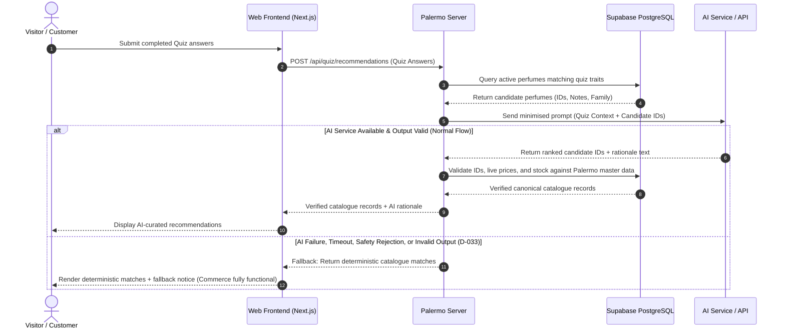
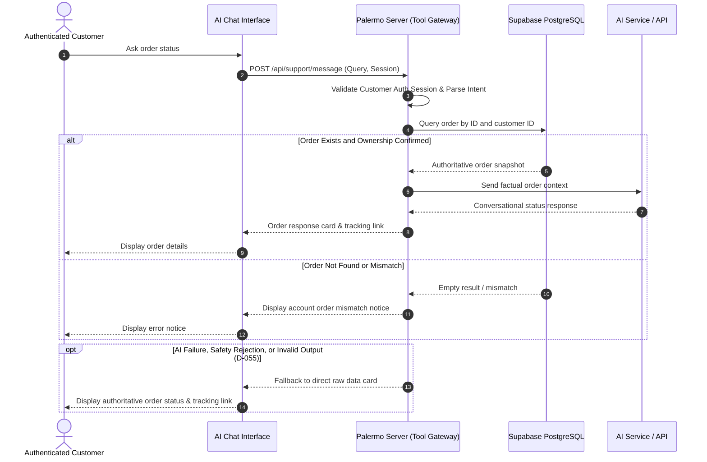

# Use Case Specifications: Personalisation, Quiz, Recommendations, and AI Support

## Scope and Traceability Summary

- **Functional Requirements Covered:** FR-PERSONAL-001 through FR-PERSONAL-008, FR-SUPPORT-001 through FR-SUPPORT-008
- **Applicable Decisions:** D-008, D-027, D-028, D-029, D-030, D-031, D-032, D-033, D-048, D-049, D-050, D-051, D-052, D-053, D-054, D-055, D-056, D-094, D-101
- **Primary Actors:** Visitor, Customer
- **External Systems:** AI service/API

---

## Global System Flow: Personalisation & Support Intent Routing

## UC-PERS-01: Customise Perfume Item (Label, Engraving, Gift Message, and Packaging)

- **Primary Actor:** Visitor / Customer
- **Traceability:** FR-PERSONAL-001, FR-PERSONAL-002, FR-PERSONAL-003, FR-PERSONAL-004
- **Decisions:** D-027, D-028
- **Preconditions:**
  1. The actor is viewing an active perfume product variant configured as eligible for customisation by an administrator.
- **Postconditions:**
  1. The selected customisations (label text, engraving text, gift message, gift packaging) are validated and attached to the target item in the cart.
  2. Master catalogue/variant records remain completely unmodified.

### Main Success Scenario
1. Actor views an administrator-approved eligible perfume variant and selects one or more customisation options:
   - Personalised label text.
   - Bottle engraving text.
   - Gift message text.
   - Gift packaging selection.
2. Actor inputs custom text and selects packaging options within system-configured validation and character constraints.
3. System validates input against configured character length, permitted character sets, and variant-level eligibility rules.
4. Actor adds the configured perfume item to the shopping cart.
5. System persists the customisation payload directly as cart item metadata without mutating product master records.

### Extensions (Alternative / Failure Flows)
- **3a. Selected variant is administrator-configured as ineligible for requested customisation:**
  1. System disables ineligible customisation fields and displays an explanatory restriction notice.
  2. Actor modifies selection to eligible options or proceeds without customisation.
- **3b. Text input exceeds configured maximum character limits or contains invalid characters:**
  1. System displays inline validation errors highlighting character constraints.
  2. Actor corrects the input before adding the item to the cart.

---

## UC-PERS-02: Get Deterministic Perfume Layering Recommendations

- **Primary Actor:** Visitor / Customer
- **Traceability:** FR-PERSONAL-005
- **Decisions:** D-029
- **Preconditions:**
  1. Actor is viewing a perfume detail page or fragrance preference profile.
- **Postconditions:**
  1. Deterministic layering combinations matching the target perfume are displayed with structured application steps.

### Main Success Scenario
1. Actor requests layering combination guidance for a selected perfume.
2. System executes deterministic compatibility logic over approved catalogue fragrance attributes (primary fragrance family, dominant notes, intensity, longevity).
3. System returns verified compatible catalogue perfumes along with application sequence guidance.
4. Actor reviews compatible layering products and can navigate to their product pages or add them to the cart.

### Extensions (Alternative / Failure Flows)
- **2a. No complementary pairing meets strict compatibility thresholds:**
  1. System displays a standard neutral layering guideline without fabricating unapproved pairings.

---

## UC-PERS-03: Assemble Personalised Sample Set

- **Primary Actor:** Visitor / Customer
- **Traceability:** FR-PERSONAL-006
- **Decisions:** D-030
- **Preconditions:**
  1. The catalogue contains administrator-configured eligible sample-size variants.
- **Postconditions:**
  1. A bounded bundle of selected sample variants is validated and added to the cart as a single bundle item.

### Main Success Scenario
1. Actor navigates to the Sample Set Builder.
2. System presents all currently available and eligible sample-sized perfume variants.
3. Actor selects the configured required number of distinct sample variants to complete the bundle.
4. System validates variant availability, configured bundle size bounds, and duplicate rules.
5. Actor adds the completed sample set to the shopping cart.

### Extensions (Alternative / Failure Flows)
- **3a. A selected sample variant goes out of stock during assembly:**
  1. System marks the variant as unavailable and prompts the actor to choose an alternate sample.
- **4a. Actor attempts to add an incomplete bundle to the cart:**
  1. System disables the cart action and displays the remaining selection count required.

---

## UC-PERS-04: Complete Fragrance Discovery Quiz and Receive Recommendations

- **Primary Actor:** Visitor / Customer
- **External System:** AI service/API
- **Traceability:** FR-PERSONAL-007, FR-PERSONAL-008
- **Decisions:** D-031, D-032, D-033, D-094, D-101
- **Preconditions:**
  1. Fragrance discovery quiz questions and answer mappings are approved in the system.
- **Postconditions:**
  1. Completed quiz responses are evaluated.
  2. If authenticated, the Customer may optionally persist the quiz results to their fragrance profile.
  3. AI-curated perfume recommendations with explanations are displayed, with all product data validated against Palermo master catalogue records.

### Sequence Diagram: Quiz & AI Recommendation Lifecycle

### Main Success Scenario
1. Actor starts the Fragrance Discovery Quiz.
2. System displays structured, multi-step questions configured in the system.
3. Actor completes all required quiz steps and submits responses.
4. System extracts structured preference attributes and queries the active product catalogue for eligible candidates.
5. System transmits the minimised context (sanitised quiz traits + candidate perfume IDs) to the AI service/API.
6. AI service returns ranked perfume candidate IDs with conversational rationale.
7. System cross-references recommended IDs against Palermo master catalogue data to retrieve authoritative pricing, availability, and titles (Palermo is the sole authority for product facts).
8. System renders verified catalogue recommendations clearly labeled as AI-generated suggestions.
9. *(Optional for Customer)* Actor saves the quiz outcome to update their Fragrance Preference Profile.

### Extensions (Alternative / Failure Flows)
- **5a. AI service experiences timeout, rate limit, safety filter rejection, or network failure (D-033):**
  1. System triggers deterministic fallback filtering matching selected quiz traits against catalogue fragrance tags.
  2. System presents deterministic product matches with a standard notification that AI reasoning is temporarily unavailable.
  3. Core catalogue viewing and checkout functionality remain completely unaffected.
- **7a. AI response returns invalid SKU, hallucinated ID, or unverified claims (D-033):**
  1. System discards unverified output and presents verified deterministic catalogue matches.

---

## UC-SUPP-01: Interact with AI Perfume Support Assistant (Public / Educational)

- **Primary Actor:** Visitor / Customer
- **External System:** AI service/API
- **Traceability:** FR-SUPPORT-001, FR-SUPPORT-002, FR-SUPPORT-003, FR-SUPPORT-006, FR-SUPPORT-007
- **Decisions:** D-048, D-049, D-050, D-051, D-052, D-053, D-055, D-056, D-094
- **Preconditions:**
  1. Chat assistant widget is accessible.
- **Postconditions:**
  1. System provides bounded answers regarding fragrance notes, general recommendations, or published policies.
  2. Support session context is retained in accordance with data retention boundaries.

### Main Success Scenario
1. Actor opens the AI support chat and enters an enquiry regarding fragrance notes, recommendations, or published store policies.
2. System identifies enquiry intent against approved support intents (NOTE_EXPLANATION, PRODUCT_ADVICE, POLICY_ENQUIRY).
3. System provides relevant canonical knowledge base or catalogue context to the AI service via server-side tools.
4. AI service synthesises a clear, conversational response strictly bounded by provided context.
5. System verifies that mentioned product references correspond to authoritative catalogue records.
6. System renders the response with interactive product/policy links.

### Extensions (Alternative / Failure Flows)
- **2a. Actor asks for return/refund authorisation:**
  1. System identifies policy enquiry intent.
  2. System explains published return policy terms and provides direct navigation to the formal return submission workflow.
  3. System explicitly states the AI assistant cannot authorize refunds or alter order states.
- **2b. Actor input triggers safety rejection, contains malicious content, or falls outside supported domains (D-055):**
  1. System returns a standard boundary safety message stating the assistant only assists with Palermo fragrances, catalogue queries, and store policies.
  2. Core store browsing and purchasing functionality remain fully operational.
- **4a. AI service experiences timeout, network failure, or invalid response format (D-055):**
  1. System renders an error notice: "Our virtual assistant is temporarily unavailable. Please browse our FAQ or contact customer support."
  2. Core catalogue browsing and checkout remain fully available.

---

## UC-SUPP-02: Authenticated Order and Delivery Enquiry

- **Primary Actor:** Customer
- **External System:** AI service/API
- **Traceability:** FR-SUPPORT-004, FR-SUPPORT-005, FR-SUPPORT-007
- **Decisions:** D-049, D-050, D-051, D-055, D-099, D-101
- **Preconditions:**
  1. Actor is logged in as an ACTIVE Customer.
- **Postconditions:**
  1. Authorised, ownership-verified order or delivery status is retrieved and explained.

### Sequence Diagram: Authenticated Order Status Enquiry

### Main Success Scenario
1. Customer enters an enquiry regarding their recent order or shipment status into the AI chat.
2. System identifies intent as ORDER_STATUS or DELIVERY_ENQUIRY.
3. System verifies customer authentication and queries authoritative internal order/fulfilment records matching the Customer's ID only.
4. Server-side tool returns minimised, factual order metadata (Order ID, fulfilment status, tracking reference, estimated delivery).
5. AI assistant formats the authoritative data into a helpful conversational response.
6. Customer reviews the order status and direct tracking link.

### Extensions (Alternative / Failure Flows)
- **1a. Actor is an unauthenticated Visitor:**
  1. System prompts the actor to log in to access account-specific order and delivery information.
- **3a. Customer requests status for an order ID belonging to a different account:**
  1. Server-side security check fails ownership validation.
  2. System returns an error: "Order not found under your account." (Prevents cross-tenant data leakage).
- **5a. AI service fails, times out, or triggers safety rejection (D-055):**
  1. System bypasses AI formatting and directly renders a deterministic order status card displaying order number, status badge, and tracking link.

---

## UC-SUPP-03: Submit Support and AI Feedback

- **Primary Actor:** Visitor / Customer
- **Traceability:** FR-SUPPORT-008
- **Decisions:** D-054, D-056
- **Preconditions:**
  1. Actor has interacted with the AI assistant or completed a recommendation flow.
- **Postconditions:**
  1. Official feedback record is stored with rating and optional comments upon explicit confirmation.

### Main Success Scenario
1. Actor clicks the feedback action (e.g., thumbs up/down, "Give Feedback" button) on a chat response or recommendation result.
2. System displays a feedback modal/form requesting rating and optional structured comments.
3. Actor completes the form and clicks "Submit Feedback".
4. System validates the feedback payload and records the entry linked to the session identifier for administrative reporting.
5. System displays a confirmation message.

### Extensions (Alternative / Failure Flows)
- **3a. Actor closes modal without clicking Submit:**
  1. System discards the draft input without persisting partial feedback.
