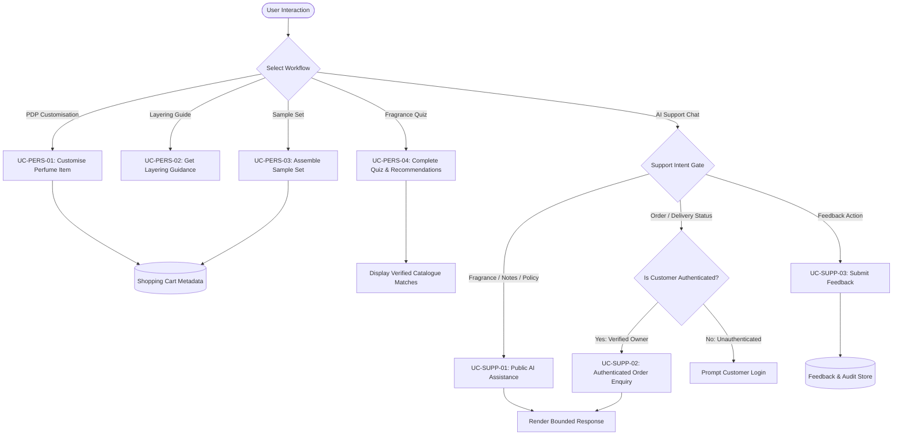

# Use Case Specifications: Personalisation, Quiz, Recommendations, and AI Support

## Scope and Traceability Summary

- **Functional Requirements Covered:** FR-PERSONAL-001 through FR-PERSONAL-008, FR-SUPPORT-001 through FR-SUPPORT-008
- **Applicable Decisions:** D-008, D-027, D-028, D-029, D-030, D-031, D-032, D-033, D-048, D-049, D-050, D-051, D-052, D-053, D-054, D-055, D-056, D-094, D-101
- **Primary Actors:** Visitor, Customer
- **External Systems:** AI service/API

---
## Global System Flow: Personalisation & Support Intent Routing

## UC-PERS-01: Customise Perfume Item (Label, Engraving, Gift Message, and Packaging)

- **Primary Actor:** Visitor / Customer
- **Traceability:** FR-PERSONAL-001, FR-PERSONAL-002, FR-PERSONAL-003, FR-PERSONAL-004
- **Decisions:** D-027, D-028
- **Preconditions:**
  1. The actor is viewing an active perfume product variant eligible for customisation.
- **Postconditions:**
  1. The selected customisations (label text, engraving text, gift message, gift packaging) are validated and attached to the target item in the cart.
  2. Master catalogue/variant records remain completely unmodified.

### Main Success Scenario
1. Actor views an eligible perfume variant and selects one or more customisation options:
   - Personalised label text.
   - Bottle engraving text.
   - Gift message text.
   - Gift packaging selection.
2. Actor inputs custom text and selects packaging options within allowed character/format constraints.
3. System validates input against length, permitted character sets, and variant eligibility rules.
4. Actor adds the configured perfume item to the shopping cart.
5. System persists the customisation payload directly as cart item metadata.

### Extensions (Alternative / Failure Flows)
- **3a. Selected variant is ineligible for requested customisation:**
  1. System disables ineligible customisation fields and displays an explanatory restriction notice.
  2. Actor modifies selection to eligible options or proceeds without customisation.
- **3b. Text input exceeds maximum character limit or fails validation:**
  1. System displays inline validation errors highlighting character limits.
  2. Actor corrects the input before adding the item to the cart.

---

## UC-PERS-02: Get Deterministic Perfume Layering Recommendations

- **Primary Actor:** Visitor / Customer
- **Traceability:** FR-PERSONAL-005
- **Decisions:** D-029
- **Preconditions:**
  1. Actor is viewing a perfume detail page or fragrance preference profile.
- **Postconditions:**
  1. Deterministic layering combinations matching the target perfume are displayed with structured layering steps.

### Main Success Scenario
1. Actor requests layering combination guidance for a selected perfume.
2. System runs deterministic compatibility logic over approved catalogue fragrance attributes.
3. System returns verified compatible catalogue perfumes along with application sequence guidance.
4. Actor reviews compatible layering products and can navigate to their product pages or add them to the cart.

---

## UC-PERS-03: Assemble Personalised Sample Set

- **Primary Actor:** Visitor / Customer
- **Traceability:** FR-PERSONAL-006
- **Decisions:** D-030
- **Preconditions:**
  1. The catalogue contains eligible sample-size variants.
- **Postconditions:**
  1. A bounded bundle of selected sample variants is validated and added to the cart as a single sample-set item.

### Main Success Scenario
1. Actor navigates to the Sample Set Builder.
2. System presents all currently available and eligible sample-sized perfume variants.
3. Actor selects the fixed required number of sample variants to complete the bundle.
4. System validates variant availability, bundle size, and duplicate rules.
5. Actor adds the completed sample set to the shopping cart.
---

## UC-PERS-04: Complete Fragrance Discovery Quiz and Receive Recommendations

- **Primary Actor:** Visitor / Customer
- **External System:** AI service/API
- **Traceability:** FR-PERSONAL-007, FR-PERSONAL-008
- **Decisions:** D-031, D-032, D-033, D-094, D-101
- **Preconditions:**
  1. Fragrance discovery quiz questions and answer mappings are approved in the system.
- **Postconditions:**
  1. Completed quiz responses are evaluated.
  2. If authenticated, the Customer may optionally persist the quiz results to their fragrance profile.
  3. AI-generated perfume recommendations with explanations are displayed to the actor.

### Main Success Scenario
1. Actor starts the Fragrance Discovery Quiz.
2. System displays structured, multi-step questions.
3. Actor completes all required quiz steps and submits responses.
4. System extracts structured preference attributes and queries catalogue candidates.
5. System transmits the minimised context to the AI service/API.
6. AI service returns ranked perfume candidates with conversational rationale.
7. System validates that all recommended items exist in the active catalogue.
8. System renders the recommendations clearly labeled as AI-generated suggestions.

---

## UC-SUPP-01: Interact with AI Perfume Support Assistant

- **Primary Actor:** Visitor / Customer
- **External System:** AI service/API
- **Traceability:** FR-SUPPORT-001, FR-SUPPORT-002, FR-SUPPORT-003, FR-SUPPORT-006, FR-SUPPORT-007
- **Decisions:** D-048, D-049, D-050, D-051, D-052, D-053, D-055, D-056, D-094
- **Preconditions:**
  1. Chat assistant widget is accessible.
- **Postconditions:**
  1. System provides bounded answers regarding fragrance notes, general recommendations, or published policies.

### Main Success Scenario
1. Actor opens the AI support chat and enters an enquiry.
2. System identifies the enquiry intent against approved support intents.
3. System provides relevant canonical knowledge base or catalogue context to the AI service.
4. AI service synthesises a clear, conversational response.
5. System presents the response with appropriate interactive product/policy links.

---

## UC-SUPP-02: Authenticated Order and Delivery Enquiry

- **Primary Actor:** Customer
- **External System:** AI service/API
- **Traceability:** FR-SUPPORT-004, FR-SUPPORT-005, FR-SUPPORT-007
- **Decisions:** D-049, D-050, D-051, D-099, D-101
- **Preconditions:**
  1. Actor is logged in as an ACTIVE Customer.
- **Postconditions:**
  1. Authorised, ownership-verified order or delivery status is retrieved and explained.

### Main Success Scenario
1. Customer enters an enquiry regarding their recent order or shipment status into the AI chat.
2. System identifies intent as ORDER_STATUS or DELIVERY_ENQUIRY.
3. System verifies customer authentication and queries internal order records for that Customer ID only.
4. Server-side tool returns minimised, factual order metadata.
5. AI assistant formats the data into a helpful response.
6. Customer reviews the order status and direct tracking link.

---

## UC-SUPP-03: Submit Support and AI Feedback

- **Primary Actor:** Visitor / Customer
- **Traceability:** FR-SUPPORT-008
- **Decisions:** D-054, D-056
- **Preconditions:**
  1. Actor has interacted with the AI assistant or completed a recommendation flow.
- **Postconditions:**
  1. Official feedback record is stored with rating and optional comments upon explicit confirmation.

### Main Success Scenario
1. Actor clicks the feedback action on a chat response or recommendation result.
2. System displays a feedback modal/form requesting rating and optional comments.
3. Actor completes the form and clicks Submit Feedback.
4. System validates the feedback payload and records the entry.
5. System displays a confirmation message.
