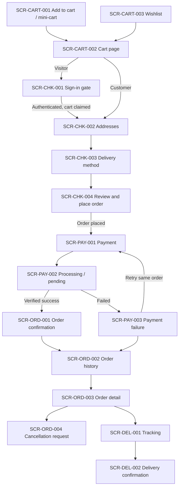

# Cart, Order, Payment and Delivery — UI Requirements

## Status

**Validated team SRS refinement for the cart, order, payment, and delivery work package.**

Specifies the user-interface requirements realising `FR-CART-001`–`FR-CART-005`, `FR-ORDER-001`–`FR-ORDER-004`, and `FR-DELIVERY-001`–`FR-DELIVERY-003`, as specified in `docs/srs/use-cases/cart-order-delivery.md`.

This is a requirements document: screens, elements, states, rules, and messages. It does not define visual design, component libraries, routes, markup, styling, or application code.

**Canonical references:** `docs/srs/use-cases/cart-order-delivery.md`, `docs/requirements/functional-requirements.md`, `docs/requirements/decision-register.md`, `docs/requirements/actor-registry.md`

---

## 1. Global UI rules

| ID | Rule | Source |
|---|---|---|
| `UIR-COD-001` | Every price, discount, delivery charge, and total displayed is a server-returned value. The interface never computes or predicts a monetary value locally. | `D-034`, `BR-COD-001` |
| `UIR-COD-002` | Cart availability indicators are informational only. No wording may state or imply that adding to the cart holds, reserves, or secures stock. | `D-036`, `BR-COD-002` |
| `UIR-COD-003` | Order, payment, invoice, cancellation, tracking, and wishlist surfaces are for authenticated `ACTIVE` Customers only. A Visitor reaching them sees the sign-in gate and resumes at the same point after authentication. No guest-checkout path appears anywhere. | `D-011`, `BR-COD-003` |
| `UIR-COD-004` | Order fulfilment state and payment state are always two distinct labelled values, never merged into one status badge. | `D-038`, `BR-COD-007` |
| `UIR-COD-005` | Card number, expiry, and CVV/CVC are rendered exclusively by the Stripe sandbox payment element. Palermo never renders, captures, autofills, mirrors, retains, or logs a card field, and no screen displays full card data. | `D-039`, `BR-COD-008` |
| `UIR-COD-006` | Every mutating action is duplicate-safe: the control is disabled and busy from activation until a server result returns, and re-submission after retry or refresh resolves to the same single outcome. | `D-040`, `D-043`, `BR-COD-009` |
| `UIR-COD-007` | Failure messages state what happened and what to do next, never exposing error codes, stack traces, internal identifiers, or configuration detail. | `D-085`, `BR-COD-018`, `NFR-ERROR-001` |
| `UIR-COD-008` | Tracking and delivery information is never fabricated. When provider data is unavailable, an explicit unavailable state with a retry is shown, not a placeholder status. | `D-046`, `BR-COD-014` |
| `UIR-COD-009` | Every screen renders correctly on desktop, tablet, and mobile; summaries and totals remain reachable without horizontal scrolling. | `NFR-RESP-001`, `D-087` |
| `UIR-COD-010` | Core workflows are fully keyboard operable, use semantic labelling and programmatic field–message association, meet WCAG 2.2 AA contrast, and never convey state by colour alone. | `D-087`, `NFR-ACC-001` |
| `UIR-COD-011` | Every asynchronous region defines loading, empty, success, and error presentations. No region lacks an error presentation. | `NFR-USE-001` |
| `UIR-COD-012` | Changes without navigation — totals recalculated, code applied or rejected, payment result, tracking update — are announced through a live region. | `D-087`, `NFR-ACC-001` |
| `UIR-COD-013` | A customer only ever sees their own orders, invoices, shipments, and cancellation requests. Order references are never exposed in a shared or guessable surface without ownership enforcement. | `D-099`, `BR-COD-017` |
| `UIR-COD-014` | Monetary values carry an explicit currency and consistent formatting across cart, checkout, confirmation, invoice, and history. | `NFR-USE-001` |
| `UIR-COD-015` | The interface never presents a refund, return, exchange, split-shipment, or alternative payment-method affordance. | `D-042`, `D-044`, `D-039` |

---

## 2. Screen inventory

| Screen ID | Screen | Actor | Use cases | Requirements |
|---|---|---|---|---|
| `SCR-CART-001` | Add-to-cart control and mini-cart | Visitor, Customer | `UC-CART-001` | `FR-CART-001` |
| `SCR-CART-002` | Cart page | Visitor, Customer | `UC-CART-001`–`UC-CART-004`, `UC-CART-006` | `FR-CART-001`–`FR-CART-004` |
| `SCR-CART-003` | Wishlist page | Customer | `UC-CART-005` | `FR-CART-005` |
| `SCR-CHK-001` | Checkout sign-in gate | Visitor | `UC-CART-006`, `UC-ORDER-001` | `FR-ORDER-001` |
| `SCR-CHK-002` | Checkout addresses step | Customer | `UC-ORDER-001` | `FR-ORDER-001` |
| `SCR-CHK-003` | Checkout delivery-method step | Customer | `UC-DELIVERY-001` | `FR-DELIVERY-001` |
| `SCR-CHK-004` | Checkout review and place order | Customer | `UC-ORDER-001`, `UC-CART-003`, `UC-CART-004` | `FR-ORDER-001`, `FR-CART-003`, `FR-CART-004` |
| `SCR-PAY-001` | Payment step | Customer | `UC-ORDER-002` | `FR-ORDER-002` |
| `SCR-PAY-002` | Payment processing / pending result | Customer | `UC-ORDER-002` | `FR-ORDER-002` |
| `SCR-PAY-003` | Payment failure and retry | Customer | `UC-ORDER-002` | `FR-ORDER-002` |
| `SCR-ORD-001` | Order confirmation | Customer | `UC-ORDER-002`, `UC-ORDER-003`, `UC-DELIVERY-002` | `FR-ORDER-001`–`FR-ORDER-003` |
| `SCR-ORD-002` | Order history list | Customer | `UC-ORDER-004` | `FR-ORDER-001`, `FR-ORDER-003`, `FR-ORDER-004` |
| `SCR-ORD-003` | Order detail | Customer | `UC-ORDER-003`–`UC-ORDER-005`, `UC-DELIVERY-002`, `UC-DELIVERY-003` | `FR-ORDER-003`, `FR-ORDER-004`, `FR-DELIVERY-002`, `FR-DELIVERY-003` |
| `SCR-ORD-004` | Cancellation request dialog | Customer | `UC-ORDER-005` | `FR-ORDER-004` |
| `SCR-DEL-001` | Shipment tracking panel | Customer | `UC-DELIVERY-002` | `FR-DELIVERY-002` |
| `SCR-DEL-002` | Delivery confirmation display | Customer | `UC-DELIVERY-003` | `FR-DELIVERY-003` |

### 2.1 Screen flow

---

## 3. Cart screens

### SCR-CART-001 — Add-to-cart control and mini-cart

**Actor** Visitor, Customer · **UC** `UC-CART-001` · **Req** `FR-CART-001`

**Elements** Variant selector with server-supplied prices · quantity input constrained to positive integers within the per-line limit · customisation selections shown only where the variant is eligible · add-to-cart action · availability indicator · mini-cart summary (line count, items, item subtotal, routes to `SCR-CART-002` and checkout).

**States** *Default* — variant selected, price shown, add enabled. *Loading* — add busy and disabled, no second submission (`UIR-COD-006`). *Added* — confirmation, updated mini-cart count, live-region announcement (`UIR-COD-012`). *Quantity increased* — states that the existing line quantity rose rather than a new line being created. *Unavailable variant* — add disabled with the reason stated. *Quantity above availability* — current availability stated, add not applied, no reservation wording (`UIR-COD-002`). *Invalid quantity* — field-level message associated with the input, cart unchanged. *Ineligible customisation* — the specific unavailable selection identified. *Error* — retriable user-safe message, cart unchanged (`UIR-COD-007`).

**Rules** The mini-cart never shows a locally calculated total (`UIR-COD-001`) · no wording may suggest stock is held or secured (`UIR-COD-002`) · adding to cart is available to Visitors with no sign-in prompt.

---

### SCR-CART-002 — Cart page

**Actor** Visitor, Customer · **UC** `UC-CART-001`–`UC-CART-004`, `UC-CART-006` · **Req** `FR-CART-001`, `FR-CART-002`, `FR-CART-003`, `FR-CART-004`

**Elements** Cart line list — per line: perfume name, variant attributes (bottle size, concentration), customisations, unit price, quantity control, line subtotal, availability indicator, remove action · order summary (item subtotal, applied discount, payable item total, all server-supplied) · promotional-code field with apply/remove and a result region · delivery-charge line shown as *calculated at the delivery step* until a method is selected (`UC-CART-003` A3) · proceed-to-checkout · continue-shopping · cart-merge notice region (`UC-CART-006`).

**States** *Loading* — busy lines and summary, no stale total shown as current. *Empty* — empty message, route to catalogue, checkout absent. *Populated* — lines, summary, checkout enabled. *Line updating* — line and summary busy, checkout disabled until totals settle (`UIR-COD-006`). *Line removed* — removal confirmed, summary recalculated, announced. *Price changed* — non-blocking notice on the line with the current price. *Line unavailable* — line marked unavailable, excluded from the payable total, checkout disabled with the blocking reason. *Quantity above availability* — availability stated, previous valid quantity retained. *Code applied* — applied code with server-calculated discount and remove action. *Code rejected* — reason from §7, total unchanged. *Code invalidated by a cart change* — removed automatically, total recalculated, reason stated (`UC-CART-004` A3). *Visitor cart* — fully functional; checkout routes to `SCR-CHK-001`. *Merge notice* — after sign-in, states that saved items were added and identifies any line capped at the per-line limit (`UC-CART-006` A3). *Totals unavailable* — explicit unavailable state with retry, no partial or locally computed total (`UC-CART-003` E2). *Error* — retriable user-safe message, last validated cart retained.

**Rules** Checkout is disabled whenever the cart is empty or holds an unavailable line · for a Visitor the checkout action makes clear that authentication precedes payment, and no guest-checkout option is offered (`UIR-COD-003`) · quantity controls enforce integers and the per-line limit at field level while the server stays authoritative · every quantity and remove control is keyboard operable with an accessible name identifying its line (`UIR-COD-010`).

---

### SCR-CART-003 — Wishlist page

**Actor** Customer · **UC** `UC-CART-005` · **Req** `FR-CART-005`

**Elements** Saved-item list with perfume name, variant where saved, current price, availability · move-to-cart per entry · remove per entry · route to perfume detail.

**States** *Loading* — busy list. *Empty* — empty message with route to catalogue. *Populated* — entries with current server-supplied price and availability. *Saved elsewhere* — the save control on catalogue and product surfaces reflects saved state consistently. *Already saved* — reported as already saved, no duplicate entry. *Entry unavailable* — marked unavailable, move-to-cart disabled with the reason. *Moved to cart* — add confirmed and mini-cart updated; the entry is removed only if the add succeeded. *Capacity limit reached* — limit stated, item not saved. *Visitor attempt* — sign-in prompted, then the save intent is replayed and confirmed (`UC-CART-005` A3). *Error* — retriable user-safe message, wishlist unchanged.

**Rules** The wishlist is never presented to a Visitor as usable beyond the sign-in prompt (`UIR-COD-003`) · saving must not be described as holding or reserving (`UIR-COD-002`).

---

## 4. Checkout screens

### SCR-CHK-001 — Checkout sign-in gate

**Actor** Visitor · **UC** `UC-CART-006`, `UC-ORDER-001` · **Req** `FR-ORDER-001`

**Elements** Explanation that an account is required to complete an order · sign-in and register actions · read-only summary of the cart being carried forward · return-to-cart.

**States** *Default* — sign-in and register with cart summary. *Authenticating* — busy, no checkout action. *Authenticated with merge* — proceeds to `SCR-CHK-002`; the merge outcome is surfaced on the cart and checkout summary (`UC-CART-006`). *Account not `ACTIVE`* — cannot proceed; reason stated and the authentication work package's recovery path offered. *Merge failed* — proceeds with the existing account cart; notice that saved visitor items could not be transferred (`UC-CART-006` failure postcondition). *Error* — retriable user-safe message, visitor cart preserved.

**Rules** No guest-checkout, continue-as-guest, or email-only checkout option appears here or anywhere else (`D-011`, `UIR-COD-003`) · after authentication the customer resumes at the point of interruption, not the catalogue.

---

### SCR-CHK-002 — Checkout addresses step

**Actor** Customer · **UC** `UC-ORDER-001` · **Req** `FR-ORDER-001`

**Elements** Current delivery address, editable or replaceable · current billing address with an explicit *same as delivery address* option (`D-004`) · notice that the addresses shown are stored with the order as they appear at placement · continue to `SCR-CHK-003`.

**States** *Loading* — busy while addresses are retrieved. *No delivery address* — entry required, continue disabled. *Complete* — both addresses resolved, continue enabled. *Validation error* — field-level messages associated with the offending inputs, step does not advance. *Save error* — retriable user-safe message, stored addresses unchanged.

**Rules** Address field design belongs to the account and profile work package; this screen consumes it and adds only the order-snapshot notice · the step must make clear that later profile edits will not change an already-placed order (`BR-COD-005`).

---

### SCR-CHK-003 — Checkout delivery-method step

**Actor** Customer · **UC** `UC-DELIVERY-001` · **Req** `FR-DELIVERY-001`

**Elements** Single-select list of active applicable delivery methods · per method: name, server-calculated charge, configured displayed delivery information · running order summary showing the charge's effect on the payable total · continue to `SCR-CHK-004`.

**States** *Loading* — busy method list, continue disabled. *Methods available* — selectable with charges, continue enabled once one is chosen. *Single method available* — preselected and clearly shown as the method that will be used. *Selection changed* — total recalculated from the server and announced (`UIR-COD-012`). *No method available* — explicit blocking state: delivery unavailable, checkout cannot proceed, no order placed (`UC-DELIVERY-001` E1). *Selected method deactivated* — selection cleared, re-selection required, continue disabled (`UC-DELIVERY-001` E2). *Method list unavailable* — retriable user-safe error; the step never advances with an unpriced method (`UC-DELIVERY-001` E4).

**Rules** Exactly one method applies per order — single-select, never a combination (`BR-COD-012`, `BR-COD-013`) · displayed delivery information is configured descriptive information, never a guaranteed carrier commitment or promised date (`UIR-COD-008`) · the charge shown is always the server-calculated value (`UIR-COD-001`) · the list is a keyboard-navigable radio group with an accessible name and per-option description (`UIR-COD-010`).

---

### SCR-CHK-004 — Checkout review and place order

**Actor** Customer · **UC** `UC-ORDER-001`, `UC-CART-003`, `UC-CART-004` · **Req** `FR-ORDER-001`, `FR-CART-003`, `FR-CART-004`

**Elements** Read-only order lines with variant, customisations, quantity, unit price, line subtotal · delivery and billing addresses as they will be stored · selected delivery method with charge and a route back to `SCR-CHK-003` · promotional-code field and applied-code summary · totals block (item subtotal, discount, delivery charge, payable total) · statement that placing the order does not take payment · place-order action.

**States** *Loading* — busy while the order is revalidated. *Ready* — values resolved, place-order enabled. *Placing* — place-order disabled and busy, no second submission (`UIR-COD-006`). *Placed* — navigation to `SCR-PAY-001`; the order exists with payment not yet taken. *Price changed at revalidation* — blocking notice with the recalculated total; explicit re-confirmation required before an order is created (`UC-ORDER-001` E5). *Code no longer valid* — code removed, total recalculated, reason stated, re-confirmation required (`UC-ORDER-001` A3). *Line no longer sellable* — blocking notice identifying the line, route back to `SCR-CART-002`, placement refused (`UC-ORDER-001` E3). *Insufficient stock* — blocking notice stating availability, placement refused, nothing held (`UC-ORDER-001` E4). *Missing address* — blocking notice, route to `SCR-CHK-002` (`UC-ORDER-001` E7). *No valid delivery method* — blocking notice, route to `SCR-CHK-003` (`UC-ORDER-001` E6). *Duplicate submission* — resolves to the single existing order and continues to payment, no second order shown (`UC-ORDER-001` E8). *Session expired* — returned to `SCR-CHK-001`, cart preserved, no order created. *Placement error* — retriable user-safe message, no partial order shown, cart still available (`UC-ORDER-001` E9).

**Rules** The interface must not imply payment has been taken at this step (`BR-COD-007`) · every blocking state names the specific problem and offers the route that resolves it · totals shown here are the values snapshotted at placement (`BR-COD-005`).

---

## 5. Payment screens

### SCR-PAY-001 — Payment step

**Actor** Customer · **UC** `UC-ORDER-002` · **Req** `FR-ORDER-002`

**Elements** Order reference and snapshotted payable total · Stripe sandbox payment element containing all card fields · statement that card details are handled by the payment provider and not stored by Palermo · sandbox/test-mode indicator · pay action · route to `SCR-ORD-003` to leave payment for later without losing the order.

**States** *Loading* — busy while the payment element initialises, pay disabled. *Ready* — element ready, pay enabled. *Submitting* — pay disabled and busy, no second attempt for the same order (`UC-ORDER-002` A2). *Provider validation error* — field-level messages rendered by the payment element, no Palermo-side card handling. *Payment element failed to load* — retriable user-safe error; the order stays payable and no attempt is recorded. *Provider unavailable* — retriable user-safe message, nothing recorded as successful (`UC-ORDER-002` E3). *Reservation expiring* — non-alarming notice that the checkout window is limited, without internal timings. *Reservation expired* — explains that availability must be revalidated before payment completes and offers the defined recovery route (`UC-ORDER-002` E5). *Order not payable* — explains the order is not awaiting payment and routes to `SCR-ORD-003`.

**Rules** Palermo renders no card input of any kind and no screen or message displays full card data (`UIR-COD-005`) · no alternative payment methods, saved cards, wallets, instalments, or cash on delivery (`UIR-COD-015`) · leaving this screen never cancels or deletes the order; it stays payable until its reservation window expires (`BR-COD-016`).

---

### SCR-PAY-002 — Payment processing and pending result

**Actor** Customer · **UC** `UC-ORDER-002` · **Req** `FR-ORDER-002`

**Elements** Processing indicator with a plain statement that the result is being confirmed · order reference · explicit instruction not to resubmit or navigate away · route to `SCR-ORD-003` once a result is known or while it remains pending.

**States** *Processing* — busy state, no payment action available. *Result pending beyond the expected window* — the order shows payment state *payment in progress*; the customer is told the result will appear on the order and is not asked to pay again (`UC-ORDER-002` A1, A2). *Verified success* — navigation to `SCR-ORD-001`. *Verified failure* — navigation to `SCR-PAY-003`. *Customer returned before a result was known* — pending presentation, no second attempt started (`UC-ORDER-002` A2). *Connection lost* — states that the result could not be confirmed in the browser, that the order carries the authoritative state, and routes to `SCR-ORD-003`.

**Rules** Success is never reported from a browser-side signal; only a server-verified result produces a success presentation (`BR-COD-008`) · refreshing or reopening never creates a second payment attempt or a second order (`UIR-COD-006`).

---

### SCR-PAY-003 — Payment failure and retry

**Actor** Customer · **UC** `UC-ORDER-002` · **Req** `FR-ORDER-002`

**Elements** Clear statement that payment was not completed and the order still exists · order reference and payable total · retry-payment returning to `SCR-PAY-001` for the same order · route to `SCR-ORD-003` · route to customer support.

**States** *Declined* — payment not completed; retry offered with a user-safe message and no provider error detail (`UC-ORDER-002` E1, `UIR-COD-007`). *Provider error or timeout* — could not be completed, retry offered, no success implied. *Abandoned attempt* — order shown as awaiting payment with a resume action (`UC-ORDER-002` E2). *Reservation expired after failure* — availability must be revalidated before a further attempt, with the defined recovery route (`UC-ORDER-002` E5). *Retry in progress* — retry disabled and busy, one attempt at a time (`UIR-COD-006`). *Repeated failure* — retry stays available and the support route becomes prominent; no automatic retry loop.

**Rules** A failed payment is never presented as a cancelled or deleted order; the order and its snapshots persist (`BR-COD-007`) · no invoice, tracking, or delivery information is offered while payment has not succeeded (`BR-COD-010`) · no refund or compensation wording appears (`UIR-COD-015`).

---

## 6. Order and delivery screens

### SCR-ORD-001 — Order confirmation

**Actor** Customer · **UC** `UC-ORDER-002`, `UC-ORDER-003`, `UC-DELIVERY-002` · **Req** `FR-ORDER-001`–`FR-ORDER-003`

**Elements** Confirmation that payment succeeded and the order is confirmed · order reference and placement time · snapshotted lines, discount, delivery method and charge, payable total · delivery and billing addresses as stored · fulfilment state and payment state shown separately (`UIR-COD-004`) · invoice action · tracking summary or a statement that a reference is being prepared · routes to `SCR-ORD-003` and the catalogue.

**States** *Confirmed with invoice and tracking* — all elements resolved. *Confirmed, invoice preparing* — invoice action shows a preparing state with retry; the confirmation is not withheld (`UC-ORDER-002` E6). *Confirmed, tracking pending* — tracking pending with retry, no reference invented (`UC-DELIVERY-002` E1, `UIR-COD-008`). *Revisited later* — the same order and same invoice, nothing duplicated (`UIR-COD-006`). *Not owned* — refused without revealing whether the order exists (`UIR-COD-013`).

**Rules** This screen appears only after a server-verified successful payment (`BR-COD-008`) · displayed values come from the order snapshot, never a live recalculation (`BR-COD-005`).

---

### SCR-ORD-002 — Order history list

**Actor** Customer · **UC** `UC-ORDER-004` · **Req** `FR-ORDER-001`, `FR-ORDER-003`, `FR-ORDER-004`

**Elements** The customer's own orders, newest first · per order: reference, placement time, snapshotted total, fulfilment state, payment state, route to `SCR-ORD-003` · contextual action per order (retry payment, view invoice, track shipment) shown only when currently permitted.

**States** *Loading* — busy list. *Empty* — empty message with route to catalogue. *Populated* — both states shown separately (`UIR-COD-004`). *Awaiting payment* — unsuccessful payment state with retry action, no invoice action (`UC-ORDER-004` A2). *Open cancellation request* — indicated as awaiting a decision, without implying an outcome. *Cancelled* — recorded cancelled state shown; the order stays listed and is never removed (`BR-COD-011`). *Delivered* — fulfilment state delivered, cancellation action absent (`UC-ORDER-004` A4). *Error* — retriable user-safe message.

**Rules** Only the authenticated customer's own orders are listed (`UIR-COD-013`) · cancelled or failed orders are never hidden; history is a complete record (`BR-COD-011`).

---

### SCR-ORD-003 — Order detail

**Actor** Customer · **UC** `UC-ORDER-003`–`UC-ORDER-005`, `UC-DELIVERY-002`, `UC-DELIVERY-003` · **Req** `FR-ORDER-003`, `FR-ORDER-004`, `FR-DELIVERY-002`, `FR-DELIVERY-003`

**Elements** Order reference, placement time, fulfilment state, payment state · snapshotted lines with variant, customisations, quantity, unit price, line subtotal · snapshotted discount, applied code, delivery method and charge, payable total · snapshotted delivery and billing addresses · payment summary (state, reference, time) with no card data (`UIR-COD-005`) · invoice action shown only where payment succeeded · tracking panel (`SCR-DEL-001`) · delivery confirmation display (`SCR-DEL-002`) once confirmed · cancellation-request action shown only while eligible · cancellation-request status once a request exists · retry-payment action while payable.

**States** *Loading* — each panel busy independently. *Awaiting payment* — retry available; invoice and tracking panels absent with the reason stated. *Paid, pre-shipment* — invoice available, tracking shows a pre-dispatch status, cancellation-request available (`UC-ORDER-004` A3). *Cancellation requested* — action replaced by a status stating the request was recorded and awaits a decision; the order otherwise intact. *Cancellation outcome recorded* — outcome shown factually, with no refund, credit, or remedy stated or implied (`UIR-COD-015`). *Dispatched* — cancellation action absent with an explanation and a route to support (`UC-ORDER-005` E1). *Delivered* — confirmation shown with source and time, cancellation action absent. *Invoice unavailable* — retriable message on the invoice action only, the rest readable (`UC-ORDER-003` E4). *Tracking unavailable* — retriable message inside the tracking panel only; snapshots stay visible and no status is fabricated (`UC-ORDER-004` E2). *Not owned* — refused without revealing whether the order exists (`UIR-COD-013`). *Error* — retriable user-safe message per panel; one panel's failure never blanks the screen.

**Rules** Fulfilment and payment states are always two labelled values (`UIR-COD-004`) · snapshotted values are never recalculated for display (`BR-COD-005`) · the invoice action is absent, not merely disabled, when no invoice exists (`BR-COD-010`) · each panel fails independently so a provider problem never hides the order record.

---

### SCR-ORD-004 — Cancellation request dialog

**Actor** Customer · **UC** `UC-ORDER-005` · **Req** `FR-ORDER-004`

**Elements** Statement that this records a request for review and is not an immediate cancellation · order reference and summary · optional reason from an approved list plus optional free text · submit and dismiss actions.

**States** *Default* — reason input available, submit enabled. *Submitting* — submit disabled and busy, a single request only (`UIR-COD-006`). *Recorded* — confirms one request recorded and awaiting a decision; the dialog closes and `SCR-ORD-003` shows the status. *Already requested* — the dialog is not offered; the existing request status is shown instead (`UC-ORDER-005` E3). *No longer eligible at submission* — blocking message that the order has been dispatched, with a route to support; no request recorded (`UC-ORDER-005` E5). *Error* — retriable user-safe message, no request recorded.

**Rules** Wording must never promise cancellation, refund, credit, or a decision timeframe (`BR-COD-011`, `UIR-COD-015`) · the dialog traps focus while open, is dismissible by keyboard, and restores focus to the invoking control on close (`UIR-COD-010`).

---

### SCR-DEL-001 — Shipment tracking panel

**Actor** Customer · **UC** `UC-DELIVERY-002` · **Req** `FR-DELIVERY-002`

**Elements** Tracking reference for the order's single shipment · current status with the time recorded · ordered status history, most recent first, each with its recorded time · refresh action · notice that tracking is provided by the Palermo simulated delivery provider for demonstration purposes.

**States** *Loading* — busy panel. *Not yet available* — states that tracking follows successful payment, no reference shown (`UC-DELIVERY-002` A1). *Reference pending* — states the reference is being prepared, with retry, no reference invented (`UC-DELIVERY-002` E1, `UIR-COD-008`). *Active* — reference, current status, and history shown. *No change since last view* — the same status and time shown, no artificial progress (`UC-DELIVERY-002` A2). *Terminal* — `DELIVERED` presented through `SCR-DEL-002`, no further updates expected (`UC-DELIVERY-002` A3). *Unavailable* — retriable user-safe message, no status fabricated (`UC-DELIVERY-002` E5). *Not owned* — access refused (`UIR-COD-013`).

**Rules** Exactly one shipment per order, with no affordance for multiple shipments or partial delivery (`BR-COD-012`, `UIR-COD-015`) · status history is append-only in presentation: statuses never appear to move backwards and duplicate provider events create no duplicate entries (`UC-DELIVERY-002` E2, E3) · the simulated-provider notice is always visible (`D-046`) · the timeline is an ordered list with text status labels, not colour or iconography alone (`UIR-COD-010`).

---

### SCR-DEL-002 — Delivery confirmation display

**Actor** Customer · **UC** `UC-DELIVERY-003` · **Req** `FR-DELIVERY-003`

**Elements** `DELIVERED` presented as the terminal shipment state · confirmation time · confirmation source identified as the Palermo simulated delivery provider · order reference and route to the invoice.

**States** *Not delivered* — the confirmation block is absent and the tracking panel shows the current status. *Delivered* — `DELIVERED`, confirmation time, and source shown together. *Delivered before first view* — shown on the next view with its recorded time, not the view time (`UC-DELIVERY-003` A1). *Repeated confirmation event* — the originally recorded source and time remain displayed and are not overwritten (`UC-DELIVERY-003` E3). *Confirmation data unavailable* — retriable user-safe message; the displayed shipment status is not altered (`UIR-COD-008`).

**Rules** Confirmation time and source always appear together; a delivered state is never shown without its recorded confirmation metadata (`BR-COD-015`) · no customer-side delivery confirmation, proof-of-delivery upload, or dispute action is offered — confirmation originates from the provider only (`D-047`) · the delivered state must not be presented as making the order editable, returnable, or refundable (`UIR-COD-015`).

---

## 7. Failure and exception message catalogue

Wording is indicative. The requirement is the condition, the user-safe content, and the recovery route.

### 7.1 Cart and promotional code

| Condition | User-safe content | Recovery |
|---|---|---|
| Variant unavailable | This item is currently unavailable. | Remove the line or choose another variant. |
| Quantity above availability | Only *n* are available at the moment. | Reduce the quantity. |
| Invalid quantity | Enter a whole number of 1 or more. | Correct the field. |
| Ineligible customisation | This option is not available for the selected variant. | Change the selection. |
| Line became unsellable | One item in your cart is no longer available and has been excluded from the total. | Remove the line to continue. |
| Totals unavailable | Totals are temporarily unavailable. | Retry. |
| Cart merge failed | Items saved before signing in could not be added. | Continue with the current cart; add items again. |
| Unknown code | This code is not valid. | Check the code and try again. |
| Expired or inactive code | This code is no longer available. | Continue without a code. |
| Eligibility not met | This code does not apply to your current cart. | Continue without a code or change the cart. |
| Code requires sign-in | Sign in to use this code. | Sign in and reapply (`ASM-COD-001`). |
| Code invalidated by a cart change | The code no longer applies and has been removed. | Continue or apply another code. |
| Code invalid at order placement | The code could not be applied to this order. Your total has been updated. | Review the total and confirm again. |

### 7.2 Checkout, placement and payment

| Condition | User-safe content | Recovery |
|---|---|---|
| Not signed in | Sign in to complete your order. | Sign-in gate, then return to the same step. |
| Account not `ACTIVE` | Your account cannot place orders at the moment. | Account recovery path. |
| Price changed | Prices have changed. Please review your updated total. | Explicit re-confirmation. |
| Insufficient stock | There is not enough stock to complete this order. | Return to the cart. |
| Missing address | A delivery address is required. | Return to the addresses step. |
| No delivery method | Choose a delivery method to continue. | Return to the delivery step. |
| Delivery unavailable | Delivery is not available for this order. | Contact support. |
| Placement failed | Your order could not be placed. Nothing has been charged. | Retry. |
| Duplicate placement submission | Resolves to the existing order; no duplicate message and no second order shown. | Continue to payment. |
| Card declined | The payment was not completed. Your order is saved. | Retry payment on the same order. |
| Provider unavailable or timeout | Payment could not be completed right now. Your order is saved. | Retry, or open the order later. |
| Payment result pending | We are confirming your payment. You do not need to pay again. | Open the order to see the result. |
| Payment abandoned | This order is awaiting payment. | Resume payment. |
| Reservation expired | We need to check availability again before completing payment. | Follow the recovery route on the order. |
| Order not payable | This order is not awaiting payment. | Open the order. |
| Duplicate callback or refresh | No duplicate confirmation, invoice, or charge is shown. | Continue. |

### 7.3 Invoice, cancellation and delivery

| Condition | User-safe content | Recovery |
|---|---|---|
| Invoice not yet available | Your invoice is being prepared. | Retry shortly. |
| Invoice unavailable | The invoice could not be opened. | Retry. |
| No invoice (payment not successful) | The invoice action is absent, with a note that an invoice is issued after successful payment. | Complete payment. |
| Cancellation not eligible | This order has been dispatched and can no longer be cancelled here. | Contact support. |
| Cancellation already requested | A cancellation request has already been recorded for this order. | View the request status. |
| Cancellation submission failed | Your cancellation request could not be recorded. | Retry. |
| Tracking pending | Tracking details are being prepared. | Retry shortly. |
| Tracking unavailable | Tracking is temporarily unavailable. | Retry. |
| Delivery confirmation unavailable | Delivery details are temporarily unavailable. | Retry. |
| Access to another customer's record | Not found. | Return to order history (`UIR-COD-013`). |

---

## 8. Accessibility and responsiveness

| ID | Requirement | Source |
|---|---|---|
| `UIA-COD-001` | The full journey — cart, checkout, delivery selection, payment, order history, cancellation request, tracking — is completable by keyboard alone with a visible focus indicator at every step. | `D-087`, `NFR-ACC-001` |
| `UIA-COD-002` | Every form control has a programmatically associated label, and every validation or error message is programmatically associated with its control. | `D-087` |
| `UIA-COD-003` | Text and meaningful non-text elements meet WCAG 2.2 AA contrast. No state — availability, payment, fulfilment, tracking — is conveyed by colour alone. | `D-087` |
| `UIA-COD-004` | Asynchronous changes (totals, code result, payment result, tracking update, cancellation recorded) are announced through an appropriately polite live region. | `D-087` |
| `UIA-COD-005` | Dialogs, including `SCR-ORD-004`, trap focus while open, are keyboard-dismissible, and restore focus to the invoking control on close. | `D-087` |
| `UIA-COD-006` | Cart lines, delivery-method lists, order history, and tracking history use semantic list and group structures with accessible names. | `D-087` |
| `UIA-COD-007` | The interface renders and stays fully operable on desktop, tablet, and mobile; summaries remain reachable without horizontal scrolling and totals remain visible or reachable at confirmation. | `NFR-RESP-001` |
| `UIA-COD-008` | Behaviour is consistent across supported current Chromium, Firefox, and Safari families. | `D-088`, `NFR-COMPAT-001` |
| `UIA-COD-009` | The Stripe sandbox payment element is presented so its own labelling, focus behaviour, and error messaging stay accessible and unobscured by Palermo layout. | `D-087`, `D-039` |

---